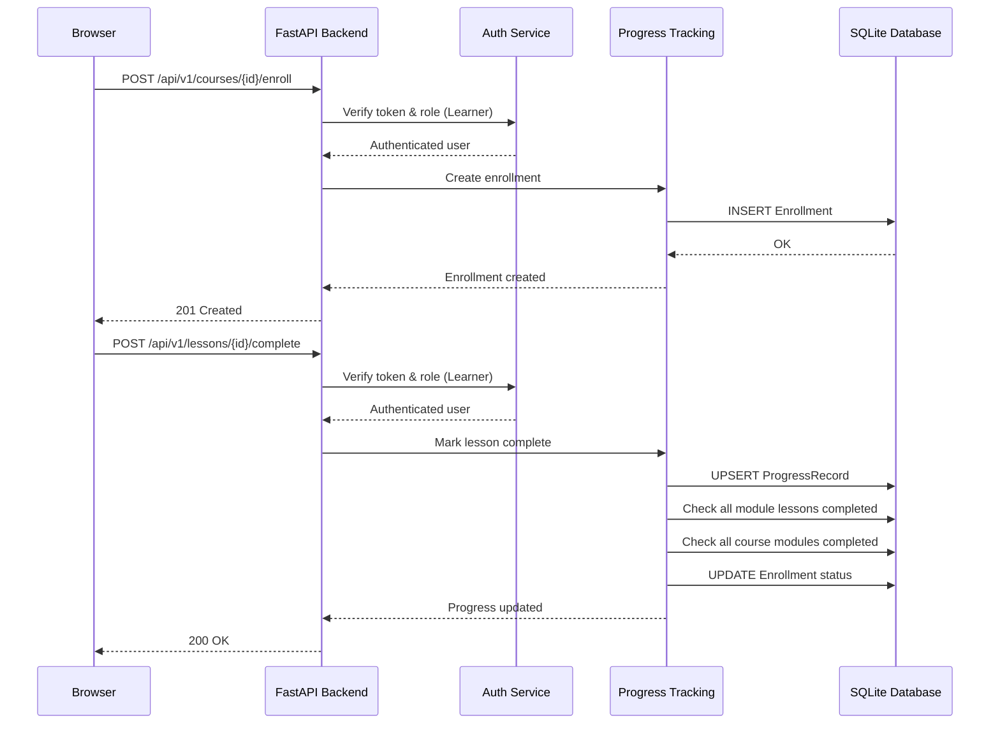
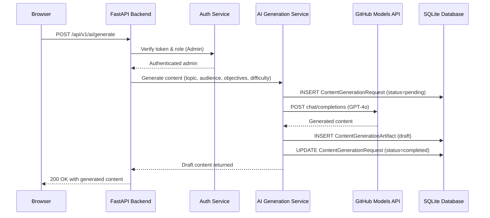

# High-Level Design (HLD)

| Field              | Value                                                   |
|--------------------|---------------------------------------------------------|
| **Title**          | AI-Powered Learning Platform MVP — High-Level Design    |
| **Version**        | 1.0                                                     |
| **Date**           | 2026-04-22                                              |
| **Author**         | 2-plan-and-design-agent                                 |
| **BRD Reference**  | docs/requirements/BRD.md v1.0                           |

---

## 1. Design Overview & Goals

### 1.1 Purpose

This HLD describes the architecture of an AI-powered learning platform built with Python 3.11+, FastAPI, SQLite, and the GitHub Models API (GPT-4o). The platform enables Learners to enroll in, progress through, and complete structured courses while Admins create and manage course content with AI-assisted generation. The MVP ships with three starter courses: GitHub Foundations, GitHub Advanced Security, and GitHub Actions.

### 1.2 Design Goals

- Keep the architecture simple and suitable for a single-developer MVP with minimal operational overhead.
- Ensure clean separation between API layer, business logic services, AI integration, and data access.
- Make it easy to add new courses and training topics without architectural changes.
- Enforce content governance (draft → review → publish) so AI-generated material is always human-reviewed.
- Provide a responsive, server-rendered web experience that works on desktop and tablet with no JavaScript framework dependencies.
- Design the AI service as a pluggable module for future MCP integration.

### 1.3 Design Constraints

- Must run locally for MVP — no cloud deployment or container orchestration required.
- GitHub Models API (GPT-4o) is the sole AI provider for content generation.
- Database must be SQLite (zero-config, file-based) — no external database servers.
- Frontend uses vanilla HTML/CSS/JS with Jinja2 server-side templates — no frontend frameworks.
- All secrets loaded from environment variables only — never hardcoded.
- AI-generated content is never auto-published; admin review is mandatory.

---

## 2. Architecture Diagram

```
┌─────────────────────────────────────────────────────────────────────┐
│                          Browser (Client)                           │
│         Jinja2 HTML Pages + Vanilla CSS/JS (Desktop/Tablet)         │
└──────────────────────────┬──────────────────────────────────────────┘
                           │ HTTP (HTML pages + REST API)
                           ▼
┌─────────────────────────────────────────────────────────────────────┐
│                     FastAPI Application Server                      │
│                          (uvicorn)                                   │
│                                                                     │
│  ┌──────────┐ ┌──────────────┐ ┌─────────────┐ ┌───────────────┐   │
│  │  Auth    │ │   Course     │ │  Progress   │ │   Reporting   │   │
│  │  Service │ │  Management  │ │  Tracking   │ │   Service     │   │
│  │          │ │  Service     │ │  Service    │ │               │   │
│  └──────────┘ └──────────────┘ └─────────────┘ └───────────────┘   │
│                                                                     │
│  ┌──────────────────┐  ┌────────────────────────────────────────┐   │
│  │  AI Generation   │  │  Frontend (Jinja2 Template Renderer)  │   │
│  │  Service         │  │  + Static Assets (CSS/JS)             │   │
│  └────────┬─────────┘  └────────────────────────────────────────┘   │
│           │                                                         │
└───────────┼───────────────────────────┬─────────────────────────────┘
            │ HTTPS                     │ SQLite
            ▼                           ▼
┌──────────────────────┐    ┌──────────────────────┐
│  GitHub Models API   │    │  SQLite Database     │
│  (GPT-4o)            │    │  (learning.db)       │
└──────────────────────┘    └──────────────────────┘
```

---

## 3. System Components

| Component ID | Name                    | Description                                                                                      | Technology                        | BRD Requirements                                          |
|--------------|-------------------------|--------------------------------------------------------------------------------------------------|-----------------------------------|-----------------------------------------------------------|
| COMP-001     | Auth Service            | Handles user registration, sign-in, session/token management, and role-based access control.     | FastAPI, Pydantic v2              | BRD-FR-001, BRD-FR-002, BRD-FR-003                       |
| COMP-002     | Course Management Service | CRUD operations for courses, modules, lessons, and quiz questions. Publish/unpublish workflow.  | FastAPI, Pydantic v2              | BRD-FR-004 – BRD-FR-018                                  |
| COMP-003     | AI Generation Service   | Integrates with GitHub Models API for content generation. Manages prompts, requests, and draft artifacts. | FastAPI, httpx, GitHub Models API | BRD-INT-001 – BRD-INT-007, BRD-FR-028 – BRD-FR-030      |
| COMP-004     | Progress Tracking Service | Manages enrollments, lesson/module/course completion tracking, and quiz attempt recording.      | FastAPI, Pydantic v2              | BRD-FR-019 – BRD-FR-024                                  |
| COMP-005     | Reporting Service       | Provides admin dashboard data, enrollment/completion statistics, and data export.                | FastAPI, Pydantic v2              | BRD-FR-025 – BRD-FR-027                                  |
| COMP-006     | Frontend (UI Layer)     | Server-rendered HTML pages via Jinja2 templates with vanilla CSS/JS. Responsive for desktop/tablet. | Jinja2, HTML, CSS, JS            | BRD-FR-035 – BRD-FR-042                                  |
| COMP-007     | Database Layer          | SQLite data store with schema for all core entities. Data access functions used by all services. | SQLite, aiosqlite                 | BRD-FR-023, BRD-NFR-009                                  |

---

## 4. Component Interactions

### 4.1 Communication Patterns

- **Client ↔ FastAPI**: HTTP requests — HTML page routes (GET) return Jinja2-rendered templates; REST API routes (`/api/v1/*`) accept/return JSON. All requests go through the auth middleware for RBAC enforcement.
- **Service ↔ Service**: Direct Python function calls within the same process. Services are organized as modules with clear interfaces but communicate in-process (no inter-service HTTP calls).
- **AI Generation Service → GitHub Models API**: Outbound HTTPS POST requests to the GitHub Models API endpoint. Authenticated with an API key from environment variables.
- **All Services → Database Layer**: Services call data access functions that execute SQL against the SQLite database. Connections use aiosqlite for async I/O.

### 4.2 Interaction Diagrams

#### 4.2.1 Learner Enrolls and Completes a Lesson



#### 4.2.2 Admin Generates AI Content



---

## 5. Data Flow Overview

### 5.1 Primary Data Flows

1. **Course Browsing Flow**: Learner requests catalog → Backend queries published courses from SQLite → Jinja2 renders course cards → HTML returned to browser.
2. **Enrollment & Progress Flow**: Learner enrolls → Enrollment record created → Learner completes lessons → ProgressRecords created → Module/course status auto-updated → Dashboard shows updated progress.
3. **AI Content Generation Flow**: Admin provides generation parameters → Backend creates ContentGenerationRequest → GitHub Models API called with constructed prompt → Generated content stored as draft ContentGenerationArtifact → Admin reviews, edits, approves → Content published to learners.
4. **Quiz Flow**: Learner submits quiz answer → Backend checks correctAnswer → QuizAttempt recorded → Scoring and explanation returned.

### 5.2 Data Flow Diagram

```
LEARNER FLOWS:
  Browse Catalog ──▶ GET /api/v1/courses ──▶ SQLite (published courses) ──▶ JSON/HTML Response
  Enroll ──▶ POST /api/v1/courses/{id}/enroll ──▶ SQLite (INSERT Enrollment) ──▶ 201 Response
  View Lesson ──▶ GET /api/v1/lessons/{id} ──▶ SQLite (lesson content) ──▶ Sanitized HTML
  Complete Lesson ──▶ POST /api/v1/lessons/{id}/complete ──▶ SQLite (ProgressRecord) ──▶ 200 Response
  Take Quiz ──▶ POST /api/v1/quizzes/{id}/attempt ──▶ SQLite (QuizAttempt) ──▶ Score + Explanation

ADMIN FLOWS:
  Create Course ──▶ POST /api/v1/courses ──▶ SQLite (INSERT Course) ──▶ 201 Response
  Generate Content ──▶ POST /api/v1/ai/generate ──▶ GitHub Models API ──▶ SQLite (draft artifact) ──▶ 200 Response
  Approve Content ──▶ POST /api/v1/ai/artifacts/{id}/approve ──▶ SQLite (UPDATE approvedBy/At) ──▶ 200 Response
  Publish Course ──▶ POST /api/v1/courses/{id}/publish ──▶ SQLite (UPDATE status) ──▶ 200 Response
```

---

## 6. GitHub Models API Integration Design

### 6.1 Integration Approach

The AI Generation Service (COMP-003) is a dedicated, self-contained module responsible for all interactions with the GitHub Models API. It:

- Constructs prompts from admin-provided inputs (topic, audience, objectives, difficulty) combined with system-level prompt templates.
- Sends HTTP POST requests to the GitHub Models API endpoint using the `httpx` async HTTP client.
- Parses and validates responses before storing them as draft ContentGenerationArtifacts.
- Implements retry logic with exponential backoff for rate limits (HTTP 429) and transient errors.
- Is designed behind an abstract interface (Python Protocol/ABC) so the implementation can be swapped for future MCP integration.

### 6.2 API Usage Patterns

| Pattern                     | Description                                                              | Endpoint / Model         |
|-----------------------------|--------------------------------------------------------------------------|--------------------------|
| Course Content Generation   | Generate lesson Markdown content from topic, audience, objectives, difficulty | GPT-4o via GitHub Models |
| Quiz Question Generation    | Generate quiz questions with options, correct answer, and explanation     | GPT-4o via GitHub Models |
| Content Section Regeneration | Regenerate a specific lesson or section without regenerating the full course | GPT-4o via GitHub Models |

### 6.3 Prompt Management

- **System Prompts**: Predefined system-level prompts establish the AI's role as an educational content creator. Stored as Python constants in the AI generation module.
- **User Prompts**: Constructed dynamically from admin inputs — topic, target audience, learning objectives, difficulty level, and desired output format (lesson Markdown or quiz JSON).
- **Prompt Storage**: Every prompt is persisted in the ContentGenerationRequest entity for auditability and reproducibility.
- **Topic Templates**: The three starter course topics (GitHub Foundations, GitHub Advanced Security, GitHub Actions) have topic-specific prompt guidance to ensure relevant, accurate content.

### 6.4 Error Handling & Resilience

- **Rate Limits (HTTP 429)**: Exponential backoff with jitter, maximum 3 retries. Each retry attempt is logged.
- **Timeout**: Request timeout of 60 seconds for content generation calls. Timeout errors are caught and returned as retryable failures.
- **API Errors (5xx)**: Treated as transient; retried with exponential backoff up to 3 times.
- **Invalid Responses**: If the API returns unparseable content, the request is marked as "failed" with an error description.
- **API Unavailability**: ContentGenerationRequest status set to "failed" with a meaningful error message. Published courses remain fully accessible from the database without any AI API dependency.
- **Key Security**: API key is never logged, never included in error messages, and never sent to the client. All error responses use generic, user-friendly messages.

---

## 7. Technology Stack

| Layer            | Technology             | Version / Notes             | Rationale                                                                   |
|------------------|------------------------|-----------------------------|-----------------------------------------------------------------------------|
| Language         | Python                 | 3.11+                       | Modern Python with excellent async support; required by project constraints |
| Web Framework    | FastAPI                | 0.115+                      | High-performance async framework with automatic OpenAPI docs, Pydantic integration, and dependency injection |
| Data Validation  | Pydantic               | v2 (2.x)                    | Type-safe request/response schemas with validation; required by project constraints |
| AI Integration   | GitHub Models API      | GPT-4o                      | Required AI provider per project constraints; GPT-4o for content generation |
| HTTP Client      | httpx                  | 0.27+                       | Async HTTP client for GitHub Models API calls; supports timeouts and retries |
| Data Storage     | SQLite                 | Bundled with Python          | Zero-config, file-based database suitable for MVP; no external server needed |
| Async DB Driver  | aiosqlite              | 0.20+                       | Async SQLite wrapper for use with FastAPI's async request handling           |
| Frontend         | Jinja2 + HTML/CSS/JS   | Jinja2 3.x                  | Server-side rendering with no frontend framework; responsive vanilla CSS    |
| XSS Sanitization | bleach or nh3          | Latest stable                | Sanitize Markdown-rendered HTML to prevent XSS in lesson content            |
| Markdown         | markdown or python-markdown | Latest stable           | Convert lesson Markdown to HTML for rendering                               |
| Testing          | pytest + httpx         | pytest 8.x, httpx 0.27+     | Async test client for FastAPI; comprehensive test coverage                  |
| Package Manager  | pip                    | Bundled with Python          | Standard Python package manager; requirements.txt for dependency management |
| ASGI Server      | uvicorn                | 0.30+                       | ASGI server for running FastAPI in development and production               |

---

## 8. Deployment Architecture

### 8.1 MVP / Local Development

The platform runs as a single Python process on a developer's machine. No containers, cloud services, or external databases are required.

```
Developer Machine
├── Python 3.11+ virtual environment
│   ├── FastAPI application
│   ├── uvicorn ASGI server (http://localhost:8000)
│   └── All pip dependencies
├── SQLite database file (learning.db)
│   └── All tables: users, courses, modules, lessons, quiz_questions,
│       enrollments, progress_records, quiz_attempts,
│       content_generation_requests, content_generation_artifacts
├── Environment variables (.env file, not committed)
│   ├── GITHUB_MODELS_API_KEY
│   ├── GITHUB_MODELS_ENDPOINT
│   ├── SECRET_KEY (for JWT/session signing)
│   └── CORS_ALLOWED_ORIGINS
└── Outbound HTTPS ──▶ GitHub Models API (api.githubmodels.com)
```

**Setup Steps:**
1. Clone the repository
2. Create a Python virtual environment: `python -m venv .venv && source .venv/bin/activate`
3. Install dependencies: `pip install -r requirements.txt`
4. Set environment variables (copy `.env.example` to `.env`)
5. Initialize the database: `python -m src.database.init` (creates tables and seeds starter courses)
6. Start the server: `uvicorn src.main:app --reload`

### 8.2 Future Deployment Considerations

- **Containerization**: Dockerfile for consistent deployments; Docker Compose for local dev with future PostgreSQL migration.
- **Database Migration**: SQLite → PostgreSQL when concurrency or scale requirements exceed MVP thresholds. Use Alembic for schema migrations.
- **Cloud Hosting**: Deploy as a container on Azure App Service, AWS ECS, or similar. SQLite replaced by managed PostgreSQL.
- **CI/CD**: GitHub Actions workflow for automated testing, linting, and deployment.

---

## 9. Security Considerations

| Area                        | Approach                                                                                                      |
|-----------------------------|---------------------------------------------------------------------------------------------------------------|
| Authentication              | Email/password authentication with hashed passwords (bcrypt). JWT tokens issued on sign-in for API access.    |
| Authorization (RBAC)        | FastAPI dependency injection checks user role on every protected endpoint. Admin-only routes return 403 for Learner role. |
| API Key Management          | GitHub Models API key loaded from `GITHUB_MODELS_API_KEY` environment variable. Never logged, displayed, or stored in code. |
| Input Validation            | All request bodies validated through Pydantic v2 models. Type-checked and constrained before processing.      |
| XSS Prevention              | Lesson Markdown converted to HTML, then sanitized using bleach/nh3 to strip script tags, event handlers, and dangerous attributes. |
| CORS                        | CORS policy configured via `CORS_ALLOWED_ORIGINS` environment variable. Scoped to allowed frontend origins only. |
| Password Storage            | Passwords hashed with bcrypt before storage. Plain-text passwords never persisted.                            |
| SQL Injection Prevention    | All database queries use parameterized statements. No string concatenation in SQL.                            |
| Session/Token Security      | JWT tokens signed with `SECRET_KEY` from environment variable. Tokens include expiration.                     |
| Dependency Security         | Dependencies pinned in requirements.txt. Regularly audit with `pip-audit` or GitHub Dependabot.              |

---

## 10. Design Decisions & Trade-offs

| Decision ID | Decision                                    | Options Considered                                         | Chosen Option              | Rationale                                                                    |
|-------------|---------------------------------------------|------------------------------------------------------------|----------------------------|------------------------------------------------------------------------------|
| DD-001      | Database engine for MVP                     | SQLite, PostgreSQL, MongoDB                                | SQLite                     | Zero-config, file-based, bundled with Python. Adequate for MVP single-server concurrency. Simplest deployment. |
| DD-002      | Frontend rendering approach                 | React SPA, Vue SPA, Jinja2 SSR, HTMX                      | Jinja2 SSR                 | No frontend build step; minimal dependencies; meets responsive requirement. Keeps stack simple for MVP. |
| DD-003      | Authentication mechanism                    | JWT tokens, session cookies, OAuth/SSO                     | JWT tokens                 | Stateless authentication suitable for REST API. Simple to implement. OAuth/SSO is out of scope for MVP. |
| DD-004      | AI service architecture                     | Inline API calls, dedicated service module, external microservice | Dedicated service module (pluggable) | Clean separation of concerns. Abstracted behind Protocol/ABC for future MCP swap. No microservice overhead for MVP. |
| DD-005      | Password hashing algorithm                  | bcrypt, argon2, scrypt                                     | bcrypt                     | Well-established, widely used, good security-performance balance. Available via `passlib` or `bcrypt` package. |
| DD-006      | Async vs sync database access               | Synchronous sqlite3, async aiosqlite                       | aiosqlite (async)          | Aligns with FastAPI's async nature. Avoids blocking the event loop on database I/O. |
| DD-007      | Markdown sanitization library               | bleach, nh3, custom regex                                  | bleach or nh3              | Established libraries for HTML sanitization. nh3 is faster (Rust-based); bleach is more widely used. Either meets XSS prevention requirements. |
| DD-008      | API versioning strategy                     | URL prefix (`/api/v1/`), header-based, query param         | URL prefix (`/api/v1/`)   | Simple, explicit, easy to evolve. Matches BRD endpoint specifications.       |
| DD-009      | Project source code organization            | Flat modules, feature-based folders, layered architecture  | Feature-based folders      | Each service (auth, courses, ai, progress, reporting) gets its own package under `src/`. Clear ownership and boundaries. |
| DD-010      | Content generation — sync vs async response | Synchronous (wait for AI response), background task + polling | Synchronous for MVP       | Simpler implementation. If AI response takes > 5 seconds, can evolve to background task per BRD-NFR-002. |

---

## 11. Traceability Matrix

| HLD Component | BRD Functional Reqs                              | BRD Non-Functional Reqs                      | BRD Integration Reqs          |
|---------------|--------------------------------------------------|----------------------------------------------|-------------------------------|
| COMP-001      | BRD-FR-001, BRD-FR-002, BRD-FR-003              | BRD-NFR-003, BRD-NFR-004, BRD-NFR-012       | —                             |
| COMP-002      | BRD-FR-004 – BRD-FR-018, BRD-FR-028 – BRD-FR-034 | BRD-NFR-001, BRD-NFR-005, BRD-NFR-011, BRD-NFR-015, BRD-NFR-016 | —               |
| COMP-003      | BRD-FR-028, BRD-FR-029, BRD-FR-030              | BRD-NFR-002, BRD-NFR-004, BRD-NFR-010, BRD-NFR-013, BRD-NFR-014 | BRD-INT-001 – BRD-INT-007 |
| COMP-004      | BRD-FR-019 – BRD-FR-024                         | BRD-NFR-001, BRD-NFR-009                     | —                             |
| COMP-005      | BRD-FR-025 – BRD-FR-027                         | BRD-NFR-001                                  | —                             |
| COMP-006      | BRD-FR-035 – BRD-FR-042                         | BRD-NFR-005, BRD-NFR-007, BRD-NFR-008       | —                             |
| COMP-007      | BRD-FR-023                                       | BRD-NFR-001, BRD-NFR-009, BRD-NFR-011       | —                             |
