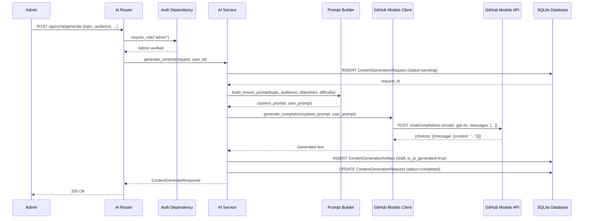
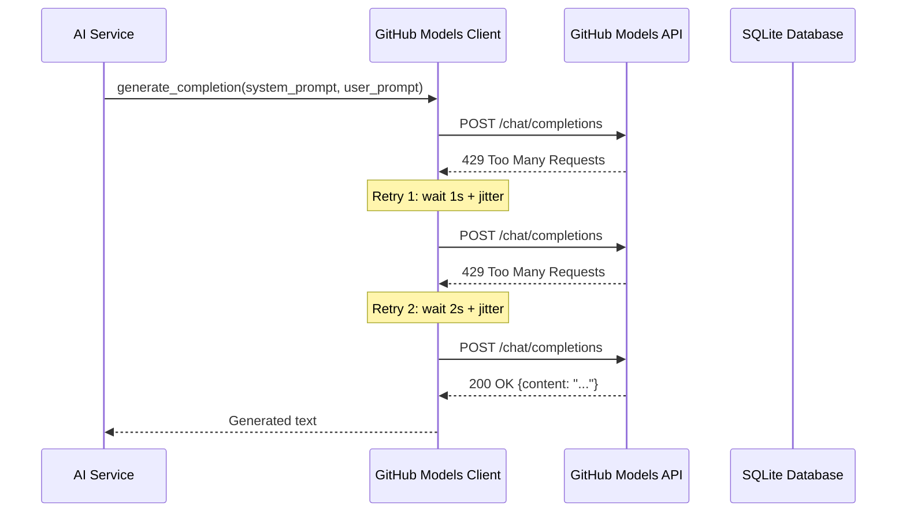
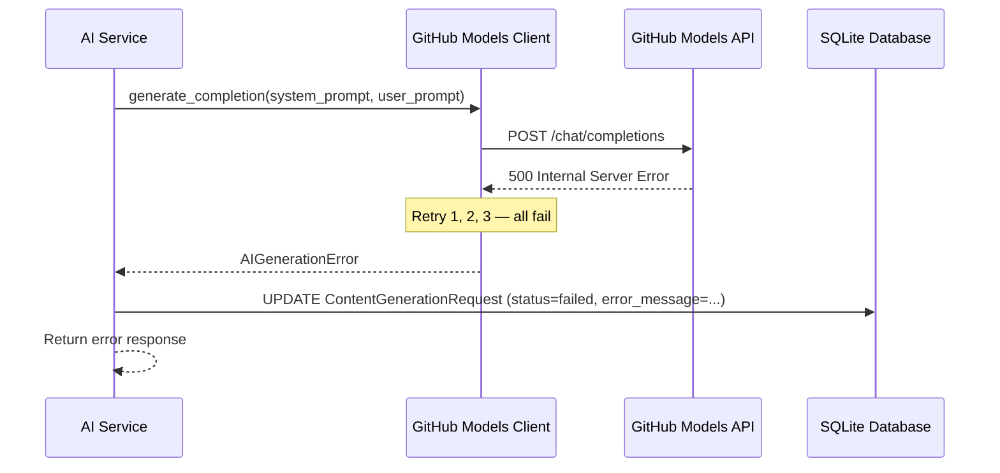

# Low-Level Design (LLD)

| Field                    | Value                                              |
|--------------------------|----------------------------------------------------|
| **Title**                | AI Generation Service — Low-Level Design           |
| **Component**            | AI Generation Service                              |
| **Version**              | 1.0                                                |
| **Date**                 | 2026-04-22                                         |
| **Author**               | 2-plan-and-design-agent                            |
| **HLD Component Ref**    | COMP-003                                           |

---

## 1. Component Purpose & Scope

### 1.1 Purpose

The AI Generation Service integrates with the GitHub Models API (GPT-4o) to generate course content — lessons and quiz questions — from admin-provided prompts. It manages content generation requests, stores draft artifacts for admin review, and implements retry logic with exponential backoff. The service is designed as a pluggable module behind an abstract interface for future MCP integration. This component satisfies BRD-INT-001 through BRD-INT-007 and BRD-FR-028 through BRD-FR-030.

### 1.2 Scope

- **Responsible for**: Prompt construction, GitHub Models API calls, ContentGenerationRequest tracking, ContentGenerationArtifact storage, retry logic with exponential backoff, draft content lifecycle, content approval workflow.
- **Not responsible for**: Course/module/lesson CRUD (COMP-002), user authentication (COMP-001), lesson content rendering (COMP-002 sanitizer), database schema creation (COMP-007).
- **Interfaces with**: COMP-001 (Auth — admin-only access), COMP-002 (Course Management — approved content becomes lesson/quiz content), COMP-007 (Database Layer).

---

## 2. Detailed Design

### 2.1 Module / Class Structure

```
src/
└── ai/
    ├── __init__.py
    ├── router.py          # FastAPI routes for /api/v1/ai/*
    ├── service.py         # Business logic: generate, approve, regenerate
    ├── models.py          # Pydantic schemas for generation requests/responses
    ├── client.py          # GitHub Models API HTTP client with retry logic
    ├── prompts.py         # Prompt templates and construction
    └── interface.py       # Abstract interface (Protocol) for pluggable AI service
```

### 2.2 Key Classes & Functions

| Class / Function                  | File          | Description                                                      | Inputs                                       | Outputs                       |
|-----------------------------------|---------------|------------------------------------------------------------------|----------------------------------------------|-------------------------------|
| `ContentGeneratorProtocol`        | interface.py  | Abstract interface (Protocol) for AI content generation          | —                                            | Protocol class                |
| `GitHubModelsClient`              | client.py     | HTTP client for GitHub Models API with retry and backoff         | api_key, endpoint, model                     | Client instance               |
| `generate_completion()`           | client.py     | Sends a prompt to GitHub Models API and returns the response     | system_prompt, user_prompt                   | Generated text string         |
| `ContentGenerateRequest`          | models.py     | Pydantic model for content generation request                    | topic, audience, objectives, difficulty, output_type | Validated model        |
| `ContentGenerateResponse`         | models.py     | Pydantic model for generation response                           | request_id, status, generated_content        | Validated model               |
| `ArtifactResponse`                | models.py     | Pydantic model for artifact data                                 | id, content, status, is_ai_generated, approved_by, approved_at | Validated model |
| `ArtifactApproveRequest`          | models.py     | Pydantic model for artifact approval                             | —                                            | Validated model               |
| `generate_content()`              | service.py    | Orchestrates content generation: create request, call API, store artifact | ContentGenerateRequest, user_id, db   | ContentGenerateResponse       |
| `approve_artifact()`              | service.py    | Marks a draft artifact as approved by an admin                   | artifact_id, admin_user_id, db               | ArtifactResponse              |
| `regenerate_content()`            | service.py    | Regenerates content for a specific artifact/lesson               | artifact_id, ContentGenerateRequest, user_id, db | ContentGenerateResponse   |
| `get_artifacts()`                 | service.py    | Lists content generation artifacts (with filtering)              | filters, db                                  | list[ArtifactResponse]        |
| `build_lesson_prompt()`           | prompts.py    | Constructs a prompt for lesson content generation                | topic, audience, objectives, difficulty      | (system_prompt, user_prompt)  |
| `build_quiz_prompt()`             | prompts.py    | Constructs a prompt for quiz question generation                 | topic, module_context, num_questions         | (system_prompt, user_prompt)  |
| `post_generate()`                 | router.py     | POST /api/v1/ai/generate endpoint handler                        | ContentGenerateRequest body                  | ContentGenerateResponse       |
| `post_approve()`                  | router.py     | POST /api/v1/ai/artifacts/{id}/approve endpoint handler          | artifact_id path param                       | ArtifactResponse              |
| `post_regenerate()`               | router.py     | POST /api/v1/ai/artifacts/{id}/regenerate endpoint handler       | artifact_id, ContentGenerateRequest body     | ContentGenerateResponse       |

### 2.3 Design Patterns Used

- **Protocol / Strategy Pattern**: `ContentGeneratorProtocol` defines the interface; `GitHubModelsClient` is the concrete implementation. Enables swapping to MCP or other providers in the future (BRD-INT-007).
- **Retry with Exponential Backoff**: The HTTP client implements automatic retry for HTTP 429 and 5xx responses with configurable max retries and backoff.
- **Service Layer**: Business logic separated from route handlers and API client.
- **Dependency Injection**: AI client injected via FastAPI `Depends()`, allowing easy testing with mocks.

---

## 3. Data Models

### 3.1 Pydantic Models

```python
from pydantic import BaseModel, Field
from typing import Optional
from datetime import datetime
from enum import Enum


class GenerationOutputType(str, Enum):
    LESSON = "lesson"
    QUIZ = "quiz"


class GenerationStatus(str, Enum):
    PENDING = "pending"
    COMPLETED = "completed"
    FAILED = "failed"


class ContentGenerateRequest(BaseModel):
    """Request body for AI content generation."""
    topic: str = Field(..., min_length=1, max_length=500)
    audience: str = Field(..., min_length=1, max_length=500)
    objectives: list[str] = Field(..., min_length=1)
    difficulty: str = Field(..., pattern="^(beginner|intermediate|advanced)$")
    output_type: GenerationOutputType = GenerationOutputType.LESSON


class ContentGenerateResponse(BaseModel):
    """Response body for content generation result."""
    request_id: int
    status: GenerationStatus
    generated_content: Optional[str] = None
    error_message: Optional[str] = None


class ArtifactResponse(BaseModel):
    """Response body for a content generation artifact."""
    id: int
    generated_content: str
    source_request_id: int
    is_ai_generated: bool = True
    approved_by: Optional[int] = None
    approved_at: Optional[datetime] = None
    created_at: datetime


class ArtifactApproveRequest(BaseModel):
    """Request body for approving an artifact (empty — action only)."""
    pass
```

### 3.2 Database Schema

```sql
CREATE TABLE content_generation_requests (
    id INTEGER PRIMARY KEY AUTOINCREMENT,
    prompt TEXT NOT NULL,
    model TEXT NOT NULL DEFAULT 'gpt-4o',
    requester_id INTEGER NOT NULL REFERENCES users(id),
    status TEXT NOT NULL DEFAULT 'pending' CHECK(status IN ('pending', 'completed', 'failed')),
    error_message TEXT,
    created_at TIMESTAMP DEFAULT CURRENT_TIMESTAMP
);

CREATE INDEX idx_cgr_requester ON content_generation_requests(requester_id);
CREATE INDEX idx_cgr_status ON content_generation_requests(status);

CREATE TABLE content_generation_artifacts (
    id INTEGER PRIMARY KEY AUTOINCREMENT,
    generated_content TEXT NOT NULL,
    source_request_id INTEGER NOT NULL REFERENCES content_generation_requests(id),
    is_ai_generated BOOLEAN NOT NULL DEFAULT 1,
    approved_by INTEGER REFERENCES users(id),
    approved_at TIMESTAMP,
    created_at TIMESTAMP DEFAULT CURRENT_TIMESTAMP
);

CREATE INDEX idx_cga_source ON content_generation_artifacts(source_request_id);
```

---

## 4. API Specifications

### 4.1 Endpoints

| Method | Path                                       | Description                                   | Auth   | Request Body            | Response Body             | Status Codes       |
|--------|--------------------------------------------|-----------------------------------------------|--------|-------------------------|---------------------------|---------------------|
| POST   | /api/v1/ai/generate                        | Generate content via GitHub Models API         | Admin  | ContentGenerateRequest  | ContentGenerateResponse   | 200, 422, 500, 503 |
| GET    | /api/v1/ai/artifacts                       | List content generation artifacts              | Admin  | —                       | list[ArtifactResponse]    | 200                 |
| GET    | /api/v1/ai/artifacts/{id}                  | Get a specific artifact                        | Admin  | —                       | ArtifactResponse          | 200, 404            |
| POST   | /api/v1/ai/artifacts/{id}/approve          | Approve a draft artifact                       | Admin  | —                       | ArtifactResponse          | 200, 400, 404       |
| POST   | /api/v1/ai/artifacts/{id}/regenerate       | Regenerate content for an artifact             | Admin  | ContentGenerateRequest  | ContentGenerateResponse   | 200, 404, 422, 503 |

### 4.2 Request / Response Examples

```json
// POST /api/v1/ai/generate
{
    "topic": "Introduction to GitHub Actions",
    "audience": "Developers new to CI/CD",
    "objectives": [
        "Understand GitHub Actions workflow syntax",
        "Create a basic CI pipeline",
        "Use common actions from the marketplace"
    ],
    "difficulty": "beginner",
    "output_type": "lesson"
}
```

```json
// 200 OK
{
    "request_id": 42,
    "status": "completed",
    "generated_content": "# Introduction to GitHub Actions\n\nGitHub Actions is a powerful CI/CD platform..."
}
```

```json
// 200 OK (after POST /api/v1/ai/artifacts/1/approve)
{
    "id": 1,
    "generated_content": "# Introduction to GitHub Actions\n\n...",
    "source_request_id": 42,
    "is_ai_generated": true,
    "approved_by": 1,
    "approved_at": "2026-04-22T11:30:00Z",
    "created_at": "2026-04-22T11:00:00Z"
}
```

---

## 5. Sequence Diagrams

### 5.1 Content Generation Flow



### 5.2 Error Flow — Rate Limit with Retry



### 5.3 Error Flow — API Failure



---

## 6. Error Handling Strategy

### 6.1 Exception Hierarchy

| Exception Class                | HTTP Status | Description                                           | Retry? |
|--------------------------------|-------------|-------------------------------------------------------|--------|
| AIGenerationError              | 503         | GitHub Models API unavailable or all retries exhausted | Yes    |
| AIRateLimitError               | 429         | Rate limit hit, retries exhausted                     | Yes    |
| AIResponseParseError           | 500         | API returned unparseable response                     | Yes    |
| ArtifactNotFoundError          | 404         | Requested artifact does not exist                     | No     |
| ArtifactAlreadyApprovedError   | 400         | Artifact is already approved                          | No     |
| Validation error               | 422         | Request body fails Pydantic validation                | No     |

### 6.2 Error Response Format

```json
{
    "detail": "AI content generation is temporarily unavailable. Please try again later."
}
```

Error messages are always user-friendly. API keys and internal error details are never exposed to the client.

### 6.3 Logging

- **INFO**: Content generation started (request_id, topic, output_type). Content generation completed (request_id, duration_ms). Artifact approved (artifact_id, admin_id).
- **WARNING**: Rate limit hit, retrying (request_id, retry_count). Timeout on API call.
- **ERROR**: All retries exhausted (request_id, error type). Unparseable API response. Request marked as failed.
- Generation calls and errors logged per BRD-NFR-013 and BRD-NFR-014.
- API key is never included in log messages.

---

## 7. Configuration & Environment Variables

| Variable                       | Description                                          | Required | Default              |
|--------------------------------|------------------------------------------------------|----------|----------------------|
| GITHUB_MODELS_API_KEY          | API key for GitHub Models API authentication         | Yes      | —                    |
| GITHUB_MODELS_ENDPOINT         | Base URL for GitHub Models API                       | Yes      | —                    |
| AI_MODEL_NAME                  | Model identifier to use for generation               | No       | gpt-4o               |
| AI_MAX_RETRIES                 | Maximum number of retry attempts for API calls       | No       | 3                    |
| AI_REQUEST_TIMEOUT_SECONDS     | Timeout in seconds for each API request              | No       | 60                   |

---

## 8. Dependencies

### 8.1 Internal Dependencies

| Component              | Purpose                                       | Interface                |
|------------------------|-----------------------------------------------|--------------------------|
| COMP-001 (Auth)        | Admin-only access to generation endpoints     | FastAPI Depends()        |
| COMP-002 (Courses)     | Generated content applied to lessons/quizzes  | Service function calls   |
| COMP-007 (Database)    | Store generation requests and artifacts       | SQL queries via aiosqlite |

### 8.2 External Dependencies

| Package / Service       | Version           | Purpose                                           |
|-------------------------|-------------------|---------------------------------------------------|
| fastapi                 | 0.115+            | Web framework, routing, dependency injection       |
| pydantic                | 2.x               | Request/response validation                        |
| httpx                   | 0.27+             | Async HTTP client for GitHub Models API calls      |
| aiosqlite               | 0.20+             | Async SQLite database access                       |
| GitHub Models API       | GPT-4o            | External AI content generation service             |

---

## 9. Traceability

| LLD Element                            | HLD Component  | BRD Requirement(s)                           |
|----------------------------------------|----------------|----------------------------------------------|
| POST /api/v1/ai/generate               | COMP-003       | BRD-INT-001, BRD-INT-002, BRD-INT-003       |
| GitHubModelsClient (retry logic)       | COMP-003       | BRD-INT-004                                  |
| Error handling (no key exposure)       | COMP-003       | BRD-INT-005                                  |
| POST /api/v1/ai/artifacts/{id}/regenerate | COMP-003    | BRD-INT-006                                  |
| ContentGeneratorProtocol (interface)   | COMP-003       | BRD-INT-007                                  |
| ContentGenerationRequest storage       | COMP-003       | BRD-FR-028, BRD-INT-002                     |
| ContentGenerationArtifact storage      | COMP-003       | BRD-FR-028, BRD-INT-003                     |
| POST /api/v1/ai/artifacts/{id}/approve | COMP-003       | BRD-FR-029                                  |
| is_ai_generated flag                   | COMP-003       | BRD-FR-030                                  |
| Logging (generation calls/errors)      | COMP-003       | BRD-NFR-013, BRD-NFR-014                    |
