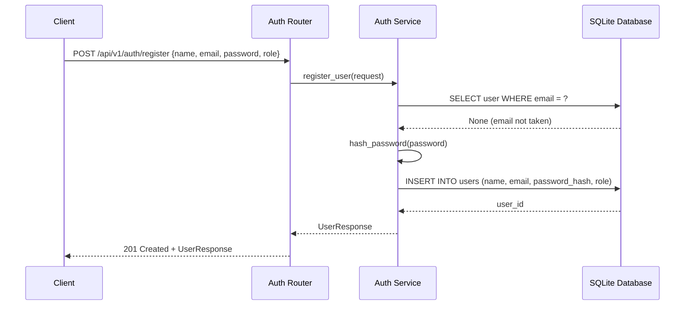
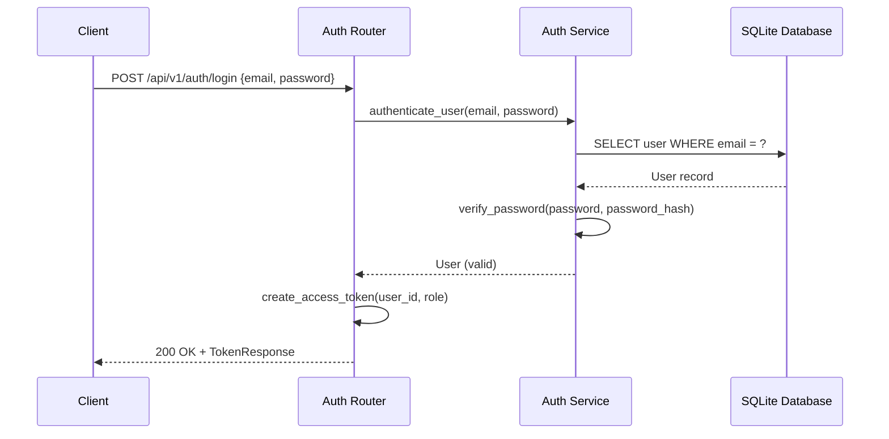
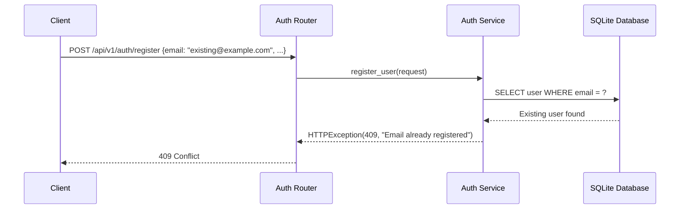

# Low-Level Design (LLD)

| Field                    | Value                                          |
|--------------------------|------------------------------------------------|
| **Title**                | Auth Service — Low-Level Design                |
| **Component**            | Auth Service                                   |
| **Version**              | 1.0                                            |
| **Date**                 | 2026-04-22                                     |
| **Author**               | 2-plan-and-design-agent                        |
| **HLD Component Ref**    | COMP-001                                       |

---

## 1. Component Purpose & Scope

### 1.1 Purpose

The Auth Service handles user registration, authentication (sign-in), and role-based access control (RBAC) for the platform. It issues JWT tokens on successful authentication and provides a reusable dependency for protecting endpoints by role. This component satisfies BRD-FR-001 (sign-in), BRD-FR-002 (RBAC), and BRD-FR-003 (registration).

### 1.2 Scope

- **Responsible for**: User registration, email/password authentication, JWT token issuance, password hashing, RBAC enforcement via FastAPI dependencies.
- **Not responsible for**: User profile management beyond registration, session persistence in browser (handled by frontend JS), database schema creation (handled by COMP-007).
- **Interfaces with**: COMP-007 (Database Layer) for user storage/retrieval; all other services use this component's RBAC dependency.

---

## 2. Detailed Design

### 2.1 Module / Class Structure

```
src/
└── auth/
    ├── __init__.py
    ├── router.py          # FastAPI route definitions for /api/v1/auth/*
    ├── service.py         # Business logic: register, authenticate, token creation
    ├── models.py          # Pydantic request/response schemas
    ├── dependencies.py    # FastAPI Depends() for current user, role checks
    └── utils.py           # Password hashing, JWT encode/decode helpers
```

### 2.2 Key Classes & Functions

| Class / Function              | File              | Description                                              | Inputs                                  | Outputs                      |
|-------------------------------|--------------------|----------------------------------------------------------|-----------------------------------------|------------------------------|
| `RegisterRequest`             | models.py          | Pydantic model for registration payload                  | name, email, password, role             | Validated model              |
| `LoginRequest`                | models.py          | Pydantic model for login payload                         | email, password                         | Validated model              |
| `TokenResponse`               | models.py          | Pydantic model for auth token response                   | access_token, token_type                | Validated model              |
| `UserResponse`                | models.py          | Pydantic model for user data (no password)               | id, name, email, role, createdAt        | Validated model              |
| `register_user()`             | service.py         | Creates a new user with hashed password                  | RegisterRequest, db connection          | UserResponse                 |
| `authenticate_user()`         | service.py         | Validates email/password and returns user                | email, password, db connection          | User dict or None            |
| `create_access_token()`       | utils.py           | Creates a signed JWT token with user claims              | user_id, role, expires_delta            | JWT string                   |
| `verify_token()`              | utils.py           | Decodes and validates a JWT token                        | token string                            | Token payload dict           |
| `hash_password()`             | utils.py           | Hashes a plain-text password with bcrypt                 | plain password string                   | Hashed password string       |
| `verify_password()`           | utils.py           | Checks a plain password against a bcrypt hash            | plain password, hashed password         | bool                         |
| `get_current_user()`          | dependencies.py    | FastAPI dependency that extracts and validates the JWT    | Authorization header (Bearer token)     | User dict                    |
| `require_role()`              | dependencies.py    | FastAPI dependency factory that checks user role          | required_role string                    | Dependency callable          |
| `post_register()`             | router.py          | POST /api/v1/auth/register endpoint handler              | RegisterRequest body                    | 201 + UserResponse           |
| `post_login()`                | router.py          | POST /api/v1/auth/login endpoint handler                 | LoginRequest body                       | 200 + TokenResponse          |

### 2.3 Design Patterns Used

- **Dependency Injection**: `get_current_user()` and `require_role()` are FastAPI `Depends()` callables injected into route handlers for authentication and authorization.
- **Service Layer**: Business logic (registration, authentication) is in `service.py`, separated from route handlers.
- **Utility Helpers**: Password hashing and JWT operations are isolated in `utils.py` for testability and reuse.

---

## 3. Data Models

### 3.1 Pydantic Models

```python
from pydantic import BaseModel, EmailStr, Field
from typing import Optional
from datetime import datetime
from enum import Enum


class UserRole(str, Enum):
    """User role enumeration."""
    ADMIN = "admin"
    LEARNER = "learner"


class RegisterRequest(BaseModel):
    """Request body for user registration."""
    name: str = Field(..., min_length=1, max_length=255)
    email: EmailStr
    password: str = Field(..., min_length=8, max_length=128)
    role: UserRole = UserRole.LEARNER


class LoginRequest(BaseModel):
    """Request body for user login."""
    email: EmailStr
    password: str


class TokenResponse(BaseModel):
    """Response body containing JWT access token."""
    access_token: str
    token_type: str = "bearer"


class UserResponse(BaseModel):
    """Response body for user data (excludes password)."""
    id: int
    name: str
    email: str
    role: UserRole
    created_at: datetime
```

### 3.2 Database Schema

```sql
CREATE TABLE users (
    id INTEGER PRIMARY KEY AUTOINCREMENT,
    name TEXT NOT NULL,
    email TEXT NOT NULL UNIQUE,
    password_hash TEXT NOT NULL,
    role TEXT NOT NULL CHECK(role IN ('admin', 'learner')),
    created_at TIMESTAMP DEFAULT CURRENT_TIMESTAMP
);

CREATE UNIQUE INDEX idx_users_email ON users(email);
```

---

## 4. API Specifications

### 4.1 Endpoints

| Method | Path                      | Description                              | Request Body       | Response Body    | Status Codes       |
|--------|---------------------------|------------------------------------------|--------------------|--------------------|---------------------|
| POST   | /api/v1/auth/register     | Register a new user account              | RegisterRequest    | UserResponse       | 201, 409, 422       |
| POST   | /api/v1/auth/login        | Authenticate and receive a JWT token     | LoginRequest       | TokenResponse      | 200, 401, 422       |

### 4.2 Request / Response Examples

```json
// POST /api/v1/auth/register
{
    "name": "Jane Learner",
    "email": "jane@example.com",
    "password": "secureP@ss1",
    "role": "learner"
}
```

```json
// 201 Created
{
    "id": 1,
    "name": "Jane Learner",
    "email": "jane@example.com",
    "role": "learner",
    "created_at": "2026-04-22T10:00:00Z"
}
```

```json
// POST /api/v1/auth/login
{
    "email": "jane@example.com",
    "password": "secureP@ss1"
}
```

```json
// 200 OK
{
    "access_token": "eyJhbGciOiJIUzI1NiIs...",
    "token_type": "bearer"
}
```

---

## 5. Sequence Diagrams

### 5.1 Registration Flow



### 5.2 Login Flow



### 5.3 Error Flow — Duplicate Email



---

## 6. Error Handling Strategy

### 6.1 Exception Hierarchy

| Exception / Status          | HTTP Status | Description                                         | Retry? |
|-----------------------------|-------------|-----------------------------------------------------|--------|
| Duplicate email on register | 409         | Email address already registered                    | No     |
| Invalid credentials         | 401         | Email/password combination does not match           | No     |
| Missing/invalid token       | 401         | Authorization header missing or JWT invalid/expired | No     |
| Insufficient role           | 403         | User does not have the required role                | No     |
| Validation error            | 422         | Request body fails Pydantic validation              | No     |

### 6.2 Error Response Format

```json
{
    "detail": "Email already registered"
}
```

FastAPI's default `HTTPException` response format is used. The `detail` field contains a user-friendly error message.

### 6.3 Logging

- **INFO**: Successful registration (user_id, email, role). Successful login (user_id).
- **WARNING**: Failed login attempt (email, reason: invalid password or unknown email).
- **ERROR**: Unexpected database errors during user operations.
- Authentication events are logged per BRD-NFR-012.

---

## 7. Configuration & Environment Variables

| Variable                  | Description                                    | Required | Default              |
|---------------------------|------------------------------------------------|----------|----------------------|
| SECRET_KEY                | Secret key for signing JWT tokens              | Yes      | —                    |
| ACCESS_TOKEN_EXPIRE_MINUTES | JWT token expiration time in minutes         | No       | 60                   |
| DATABASE_URL              | Path to SQLite database file                   | No       | sqlite:///learning.db |

---

## 8. Dependencies

### 8.1 Internal Dependencies

| Component          | Purpose                                       | Interface                |
|--------------------|-----------------------------------------------|--------------------------|
| COMP-007 (Database)| Store and retrieve user records                | SQL queries via aiosqlite |

### 8.2 External Dependencies

| Package / Service       | Version           | Purpose                                           |
|-------------------------|-------------------|---------------------------------------------------|
| fastapi                 | 0.115+            | Web framework, routing, dependency injection       |
| pydantic[email]         | 2.x               | Request/response validation with EmailStr          |
| python-jose[cryptography] | 3.x             | JWT token creation and verification                |
| passlib[bcrypt]         | 1.7+              | Password hashing with bcrypt                       |
| aiosqlite               | 0.20+             | Async SQLite database access                       |

---

## 9. Traceability

| LLD Element                  | HLD Component  | BRD Requirement(s)                     |
|------------------------------|----------------|----------------------------------------|
| POST /api/v1/auth/register   | COMP-001       | BRD-FR-003                             |
| POST /api/v1/auth/login      | COMP-001       | BRD-FR-001                             |
| get_current_user()           | COMP-001       | BRD-FR-002, BRD-NFR-003               |
| require_role()               | COMP-001       | BRD-FR-002, BRD-NFR-003               |
| hash_password()              | COMP-001       | BRD-NFR-004 (no hardcoded secrets)     |
| Logging (auth events)        | COMP-001       | BRD-NFR-012                            |
