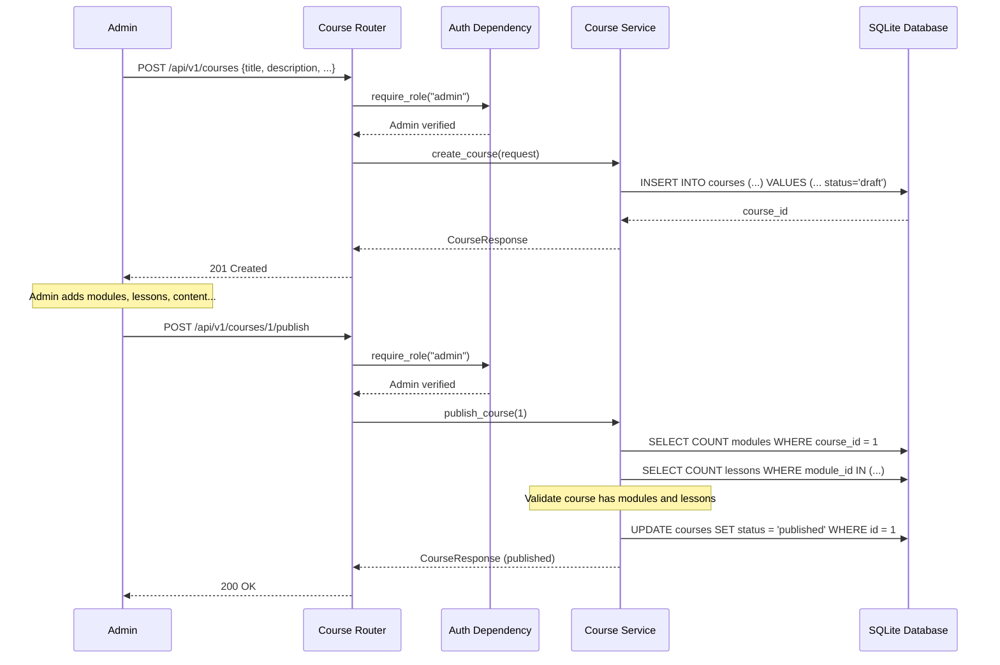
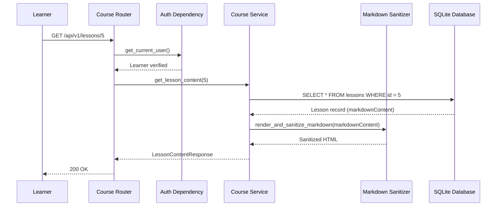

# Low-Level Design (LLD)

| Field                    | Value                                              |
|--------------------------|----------------------------------------------------|
| **Title**                | Course Management Service — Low-Level Design       |
| **Component**            | Course Management Service                          |
| **Version**              | 1.0                                                |
| **Date**                 | 2026-04-22                                         |
| **Author**               | 2-plan-and-design-agent                            |
| **HLD Component Ref**    | COMP-002                                           |

---

## 1. Component Purpose & Scope

### 1.1 Purpose

The Course Management Service provides CRUD operations for courses, modules, lessons, and quiz questions. It manages the content lifecycle including publish/unpublish workflows, course catalog access, and content governance (draft/published status). This component is the core content management backbone of the platform, satisfying BRD-FR-004 through BRD-FR-018 and BRD-FR-028 through BRD-FR-034.

### 1.2 Scope

- **Responsible for**: CRUD for courses, modules, lessons, and quiz questions. Publish/unpublish course status transitions. Course catalog retrieval (role-aware). Lesson content retrieval with XSS sanitization. Quiz answer validation and attempt recording. Starter course seeding.
- **Not responsible for**: User authentication (COMP-001), AI content generation (COMP-003), enrollment and progress tracking (COMP-004), reporting aggregations (COMP-005).
- **Interfaces with**: COMP-001 (Auth — RBAC dependencies), COMP-003 (AI Generation — receives generated content for lessons), COMP-004 (Progress Tracking — lessons/modules referenced by progress records), COMP-007 (Database Layer).

---

## 2. Detailed Design

### 2.1 Module / Class Structure

```
src/
└── courses/
    ├── __init__.py
    ├── router.py          # FastAPI routes for /api/v1/courses/*, /api/v1/modules/*, /api/v1/lessons/*, /api/v1/quizzes/*
    ├── service.py         # Business logic: CRUD, publish/unpublish, catalog queries
    ├── models.py          # Pydantic schemas for courses, modules, lessons, quizzes
    └── sanitizer.py       # Markdown-to-HTML rendering with XSS sanitization
```

### 2.2 Key Classes & Functions

| Class / Function                  | File          | Description                                                     | Inputs                                   | Outputs                     |
|-----------------------------------|---------------|-----------------------------------------------------------------|------------------------------------------|-----------------------------|
| `CourseCreateRequest`             | models.py     | Pydantic model for course creation                              | title, description, difficulty, estimatedDuration, tags | Validated model   |
| `CourseUpdateRequest`             | models.py     | Pydantic model for course metadata update                       | title?, description?, difficulty?, estimatedDuration?, tags? | Validated model |
| `CourseResponse`                  | models.py     | Pydantic model for course data                                  | All course fields                        | Validated model              |
| `CourseDetailResponse`            | models.py     | Course with nested modules and lesson summaries                 | Course + modules + lessons               | Validated model              |
| `ModuleCreateRequest`             | models.py     | Pydantic model for module creation                              | title, summary, sortOrder                | Validated model              |
| `ModuleResponse`                  | models.py     | Pydantic model for module data                                  | All module fields                        | Validated model              |
| `LessonCreateRequest`             | models.py     | Pydantic model for lesson creation                              | title, markdownContent, estimatedMinutes, sortOrder | Validated model    |
| `LessonResponse`                  | models.py     | Pydantic model for lesson data                                  | All lesson fields                        | Validated model              |
| `LessonContentResponse`          | models.py     | Lesson with sanitized HTML content                              | id, title, htmlContent                   | Validated model              |
| `QuizQuestionCreateRequest`       | models.py     | Pydantic model for quiz question creation                       | question, options, correctAnswer, explanation | Validated model         |
| `QuizQuestionResponse`            | models.py     | Pydantic model for quiz question (no answer for learners)       | id, question, options                    | Validated model              |
| `QuizAttemptRequest`              | models.py     | Pydantic model for quiz answer submission                       | selectedAnswer                           | Validated model              |
| `QuizAttemptResponse`             | models.py     | Quiz attempt result with scoring                                | isCorrect, explanation                   | Validated model              |
| `create_course()`                 | service.py    | Creates a new course in draft status                            | CourseCreateRequest, db                  | CourseResponse               |
| `update_course()`                 | service.py    | Updates course metadata                                         | course_id, CourseUpdateRequest, db       | CourseResponse               |
| `delete_course()`                 | service.py    | Deletes course and all child entities                           | course_id, db                            | None                         |
| `publish_course()`                | service.py    | Changes course status to published                              | course_id, db                            | CourseResponse               |
| `unpublish_course()`              | service.py    | Reverts course status to draft                                  | course_id, db                            | CourseResponse               |
| `get_courses()`                   | service.py    | Returns courses (published only for learners, all for admins)   | user_role, db                            | list[CourseResponse]         |
| `get_course_detail()`             | service.py    | Returns course with modules and lesson summaries                | course_id, db                            | CourseDetailResponse         |
| `create_module()`                 | service.py    | Creates a module within a course                                | course_id, ModuleCreateRequest, db       | ModuleResponse               |
| `create_lesson()`                 | service.py    | Creates a lesson within a module                                | module_id, LessonCreateRequest, db       | LessonResponse               |
| `get_lesson_content()`            | service.py    | Returns lesson with sanitized HTML content                      | lesson_id, db                            | LessonContentResponse        |
| `create_quiz_question()`          | service.py    | Creates a quiz question for a module                            | module_id, QuizQuestionCreateRequest, db | QuizQuestionResponse         |
| `submit_quiz_attempt()`           | service.py    | Records quiz attempt and returns scoring                        | quiz_id, user_id, QuizAttemptRequest, db | QuizAttemptResponse          |
| `render_and_sanitize_markdown()`  | sanitizer.py  | Converts Markdown to sanitized HTML                             | markdown_string                          | Sanitized HTML string        |

### 2.3 Design Patterns Used

- **Service Layer**: All business logic in `service.py`, separated from route handlers in `router.py`.
- **Dependency Injection**: Auth dependencies (`get_current_user`, `require_role("admin")`) injected into admin-only routes.
- **Cascade Delete**: Deleting a course cascades to modules, lessons, and quiz questions via SQL `ON DELETE CASCADE` or service-level cascade.
- **Strategy Pattern (Sanitization)**: `sanitizer.py` isolates the Markdown rendering and sanitization strategy, making it swappable.

---

## 3. Data Models

### 3.1 Pydantic Models

```python
from pydantic import BaseModel, Field
from typing import Optional
from datetime import datetime
from enum import Enum


class CourseStatus(str, Enum):
    DRAFT = "draft"
    PUBLISHED = "published"


class CourseDifficulty(str, Enum):
    BEGINNER = "beginner"
    INTERMEDIATE = "intermediate"
    ADVANCED = "advanced"


class CourseCreateRequest(BaseModel):
    """Request body for creating a course."""
    title: str = Field(..., min_length=1, max_length=500)
    description: str = Field(..., min_length=1)
    difficulty: CourseDifficulty
    estimated_duration: int = Field(..., gt=0, description="Duration in minutes")
    tags: list[str] = Field(default_factory=list)


class CourseUpdateRequest(BaseModel):
    """Request body for updating course metadata."""
    title: Optional[str] = Field(None, min_length=1, max_length=500)
    description: Optional[str] = None
    difficulty: Optional[CourseDifficulty] = None
    estimated_duration: Optional[int] = Field(None, gt=0)
    tags: Optional[list[str]] = None


class CourseResponse(BaseModel):
    """Response body for course data."""
    id: int
    title: str
    description: str
    status: CourseStatus
    difficulty: CourseDifficulty
    estimated_duration: int
    tags: list[str]
    created_at: datetime


class ModuleCreateRequest(BaseModel):
    """Request body for creating a module."""
    title: str = Field(..., min_length=1, max_length=500)
    summary: str = Field(..., min_length=1)
    sort_order: int = Field(..., ge=0)


class ModuleResponse(BaseModel):
    """Response body for module data."""
    id: int
    course_id: int
    title: str
    summary: str
    sort_order: int


class LessonCreateRequest(BaseModel):
    """Request body for creating a lesson."""
    title: str = Field(..., min_length=1, max_length=500)
    markdown_content: str
    estimated_minutes: int = Field(..., gt=0)
    sort_order: int = Field(..., ge=0)


class LessonResponse(BaseModel):
    """Response body for lesson data."""
    id: int
    module_id: int
    title: str
    markdown_content: str
    estimated_minutes: int
    sort_order: int


class LessonContentResponse(BaseModel):
    """Lesson with rendered and sanitized HTML content."""
    id: int
    title: str
    html_content: str
    estimated_minutes: int


class QuizQuestionCreateRequest(BaseModel):
    """Request body for creating a quiz question."""
    question: str = Field(..., min_length=1)
    options: list[str] = Field(..., min_length=2)
    correct_answer: str
    explanation: str


class QuizQuestionResponse(BaseModel):
    """Response body for quiz question (no answer for learners)."""
    id: int
    module_id: int
    question: str
    options: list[str]


class QuizAttemptRequest(BaseModel):
    """Request body for submitting a quiz answer."""
    selected_answer: str


class QuizAttemptResponse(BaseModel):
    """Response body for quiz attempt result."""
    is_correct: bool
    explanation: str
```

### 3.2 Database Schema

```sql
CREATE TABLE courses (
    id INTEGER PRIMARY KEY AUTOINCREMENT,
    title TEXT NOT NULL,
    description TEXT NOT NULL,
    status TEXT NOT NULL DEFAULT 'draft' CHECK(status IN ('draft', 'published')),
    difficulty TEXT NOT NULL CHECK(difficulty IN ('beginner', 'intermediate', 'advanced')),
    estimated_duration INTEGER NOT NULL,
    tags TEXT DEFAULT '[]',  -- JSON array stored as text
    created_at TIMESTAMP DEFAULT CURRENT_TIMESTAMP
);

CREATE TABLE modules (
    id INTEGER PRIMARY KEY AUTOINCREMENT,
    course_id INTEGER NOT NULL REFERENCES courses(id) ON DELETE CASCADE,
    title TEXT NOT NULL,
    summary TEXT NOT NULL,
    sort_order INTEGER NOT NULL DEFAULT 0
);

CREATE INDEX idx_modules_course_id ON modules(course_id);

CREATE TABLE lessons (
    id INTEGER PRIMARY KEY AUTOINCREMENT,
    module_id INTEGER NOT NULL REFERENCES modules(id) ON DELETE CASCADE,
    title TEXT NOT NULL,
    markdown_content TEXT NOT NULL DEFAULT '',
    estimated_minutes INTEGER NOT NULL DEFAULT 5,
    sort_order INTEGER NOT NULL DEFAULT 0
);

CREATE INDEX idx_lessons_module_id ON lessons(module_id);

CREATE TABLE quiz_questions (
    id INTEGER PRIMARY KEY AUTOINCREMENT,
    module_id INTEGER NOT NULL REFERENCES modules(id) ON DELETE CASCADE,
    question TEXT NOT NULL,
    options TEXT NOT NULL DEFAULT '[]',  -- JSON array stored as text
    correct_answer TEXT NOT NULL,
    explanation TEXT NOT NULL DEFAULT ''
);

CREATE INDEX idx_quiz_questions_module_id ON quiz_questions(module_id);
```

---

## 4. API Specifications

### 4.1 Endpoints

| Method | Path                                     | Description                                    | Auth         | Request Body               | Response Body           | Status Codes        |
|--------|------------------------------------------|------------------------------------------------|--------------|----------------------------|-------------------------|----------------------|
| GET    | /api/v1/courses                          | List courses (published for learners, all for admins) | Learner/Admin | —                        | list[CourseResponse]    | 200                  |
| POST   | /api/v1/courses                          | Create a new course (draft)                    | Admin        | CourseCreateRequest        | CourseResponse          | 201, 422             |
| GET    | /api/v1/courses/{id}                     | Get course detail with modules and lessons     | Learner/Admin | —                        | CourseDetailResponse    | 200, 404             |
| PUT    | /api/v1/courses/{id}                     | Update course metadata                         | Admin        | CourseUpdateRequest        | CourseResponse          | 200, 404, 422        |
| DELETE | /api/v1/courses/{id}                     | Delete course and all children                 | Admin        | —                          | —                       | 204, 404             |
| POST   | /api/v1/courses/{id}/publish             | Publish a course                               | Admin        | —                          | CourseResponse          | 200, 400, 404        |
| POST   | /api/v1/courses/{id}/unpublish           | Unpublish a course                             | Admin        | —                          | CourseResponse          | 200, 404             |
| POST   | /api/v1/courses/{courseId}/modules       | Create a module in a course                    | Admin        | ModuleCreateRequest        | ModuleResponse          | 201, 404, 422        |
| PUT    | /api/v1/modules/{id}                     | Update a module                                | Admin        | ModuleCreateRequest        | ModuleResponse          | 200, 404, 422        |
| DELETE | /api/v1/modules/{id}                     | Delete a module and its children               | Admin        | —                          | —                       | 204, 404             |
| POST   | /api/v1/modules/{moduleId}/lessons       | Create a lesson in a module                    | Admin        | LessonCreateRequest        | LessonResponse          | 201, 404, 422        |
| GET    | /api/v1/lessons/{id}                     | Get lesson with sanitized HTML content         | Learner/Admin | —                        | LessonContentResponse   | 200, 404             |
| PUT    | /api/v1/lessons/{id}                     | Update a lesson                                | Admin        | LessonCreateRequest        | LessonResponse          | 200, 404, 422        |
| DELETE | /api/v1/lessons/{id}                     | Delete a lesson                                | Admin        | —                          | —                       | 204, 404             |
| POST   | /api/v1/modules/{moduleId}/quizzes       | Create a quiz question                         | Admin        | QuizQuestionCreateRequest  | QuizQuestionResponse    | 201, 404, 422        |
| PUT    | /api/v1/quizzes/{id}                     | Update a quiz question                         | Admin        | QuizQuestionCreateRequest  | QuizQuestionResponse    | 200, 404, 422        |
| DELETE | /api/v1/quizzes/{id}                     | Delete a quiz question                         | Admin        | —                          | —                       | 204, 404             |
| POST   | /api/v1/quizzes/{id}/attempt             | Submit a quiz answer (learner)                 | Learner      | QuizAttemptRequest         | QuizAttemptResponse     | 200, 404, 422        |

### 4.2 Request / Response Examples

```json
// POST /api/v1/courses
{
    "title": "GitHub Foundations",
    "description": "Learn the fundamentals of GitHub including repositories, branches, and pull requests.",
    "difficulty": "beginner",
    "estimated_duration": 120,
    "tags": ["github", "foundations", "beginner"]
}
```

```json
// 201 Created
{
    "id": 1,
    "title": "GitHub Foundations",
    "description": "Learn the fundamentals of GitHub...",
    "status": "draft",
    "difficulty": "beginner",
    "estimated_duration": 120,
    "tags": ["github", "foundations", "beginner"],
    "created_at": "2026-04-22T10:00:00Z"
}
```

```json
// POST /api/v1/quizzes/1/attempt
{
    "selected_answer": "A branch is a pointer to a specific commit"
}
```

```json
// 200 OK
{
    "is_correct": true,
    "explanation": "Correct! A branch in Git is a lightweight movable pointer to a commit."
}
```

---

## 5. Sequence Diagrams

### 5.1 Course Creation and Publishing Flow



### 5.2 Lesson Content Retrieval with Sanitization



---

## 6. Error Handling Strategy

### 6.1 Exception Hierarchy

| Exception / Condition               | HTTP Status | Description                                          | Retry? |
|--------------------------------------|-------------|------------------------------------------------------|--------|
| Course/module/lesson/quiz not found  | 404         | Requested resource does not exist                    | No     |
| Publish course with no content       | 400         | Cannot publish a course with no modules or lessons   | No     |
| Already enrolled                     | 400         | Learner is already enrolled in the course            | No     |
| Validation error                     | 422         | Request body fails Pydantic validation               | No     |
| Unauthorized                         | 401         | Missing or invalid authentication token              | No     |
| Forbidden                            | 403         | Learner attempting admin-only operation              | No     |

### 6.2 Error Response Format

```json
{
    "detail": "Course not found"
}
```

### 6.3 Logging

- **INFO**: Course created (course_id, title). Course published/unpublished (course_id). Module/lesson/quiz created.
- **WARNING**: Attempt to publish course with no content.
- **ERROR**: Database errors during CRUD operations.
- Publishing actions logged per BRD-NFR-013.

---

## 7. Configuration & Environment Variables

| Variable                  | Description                                    | Required | Default              |
|---------------------------|------------------------------------------------|----------|----------------------|
| DATABASE_URL              | Path to SQLite database file                   | No       | sqlite:///learning.db |

No additional configuration beyond the shared application settings.

---

## 8. Dependencies

### 8.1 Internal Dependencies

| Component              | Purpose                                       | Interface                |
|------------------------|-----------------------------------------------|--------------------------|
| COMP-001 (Auth)        | RBAC enforcement on admin routes              | FastAPI Depends()        |
| COMP-007 (Database)    | Persistent storage of all content entities    | SQL queries via aiosqlite |

### 8.2 External Dependencies

| Package / Service       | Version           | Purpose                                           |
|-------------------------|-------------------|---------------------------------------------------|
| fastapi                 | 0.115+            | Web framework, routing, dependency injection       |
| pydantic                | 2.x               | Request/response validation                        |
| markdown                | 3.x               | Convert Markdown to HTML                           |
| bleach or nh3           | Latest stable      | Sanitize HTML to prevent XSS                       |
| aiosqlite               | 0.20+             | Async SQLite database access                       |

---

## 9. Traceability

| LLD Element                            | HLD Component  | BRD Requirement(s)                     |
|----------------------------------------|----------------|----------------------------------------|
| POST /api/v1/courses                   | COMP-002       | BRD-FR-004                             |
| PUT /api/v1/courses/{id}               | COMP-002       | BRD-FR-005                             |
| DELETE /api/v1/courses/{id}            | COMP-002       | BRD-FR-006                             |
| POST /api/v1/courses/{id}/publish      | COMP-002       | BRD-FR-007                             |
| POST /api/v1/courses/{id}/unpublish    | COMP-002       | BRD-FR-008                             |
| GET /api/v1/courses                    | COMP-002       | BRD-FR-009                             |
| GET /api/v1/courses/{id}               | COMP-002       | BRD-FR-010                             |
| POST /api/v1/courses/{courseId}/modules | COMP-002      | BRD-FR-011                             |
| PUT/DELETE /api/v1/modules/{id}        | COMP-002       | BRD-FR-012                             |
| POST /api/v1/modules/{moduleId}/lessons | COMP-002      | BRD-FR-013                             |
| PUT/DELETE /api/v1/lessons/{id}        | COMP-002       | BRD-FR-014                             |
| GET /api/v1/lessons/{id} (sanitized)   | COMP-002       | BRD-FR-015, BRD-NFR-005               |
| POST /api/v1/modules/{moduleId}/quizzes | COMP-002      | BRD-FR-016                             |
| PUT/DELETE /api/v1/quizzes/{id}        | COMP-002       | BRD-FR-017                             |
| POST /api/v1/quizzes/{id}/attempt      | COMP-002       | BRD-FR-018                             |
| render_and_sanitize_markdown()         | COMP-002       | BRD-FR-015, BRD-NFR-005               |
| Starter course seeding                 | COMP-002       | BRD-FR-031, BRD-FR-032, BRD-FR-033, BRD-FR-034 |
