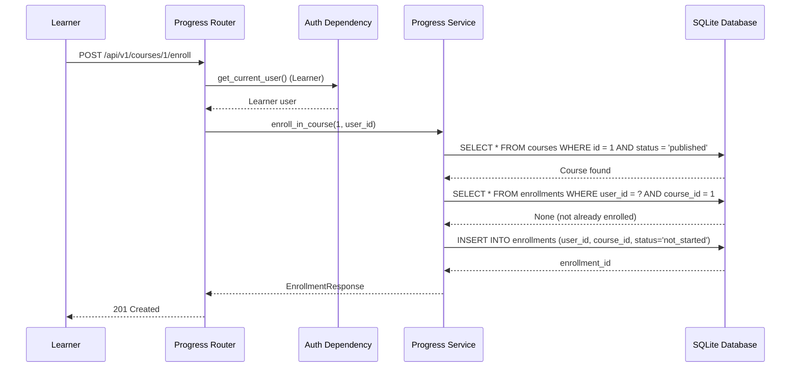
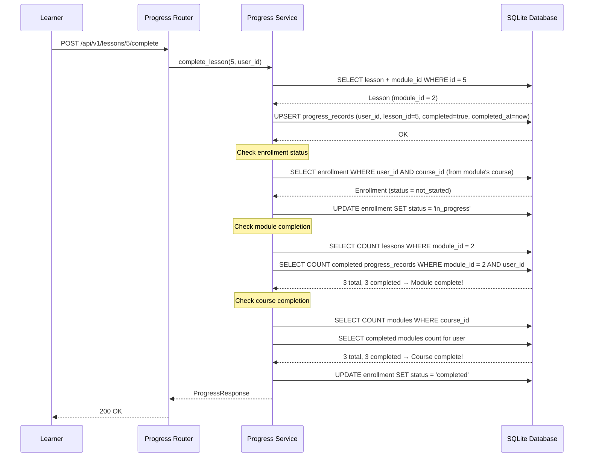

# Low-Level Design (LLD)

| Field                    | Value                                                 |
|--------------------------|-------------------------------------------------------|
| **Title**                | Progress Tracking Service — Low-Level Design          |
| **Component**            | Progress Tracking Service                             |
| **Version**              | 1.0                                                   |
| **Date**                 | 2026-04-22                                            |
| **Author**               | 2-plan-and-design-agent                               |
| **HLD Component Ref**    | COMP-004                                              |

---

## 1. Component Purpose & Scope

### 1.1 Purpose

The Progress Tracking Service manages learner enrollments in courses and tracks completion progress at the lesson, module, and course level. It handles quiz attempt recording and provides the data for the learner dashboard. This component satisfies BRD-FR-019 through BRD-FR-024.

### 1.2 Scope

- **Responsible for**: Course enrollment (create, list), lesson completion tracking, automatic module/course completion status updates, quiz attempt recording, learner dashboard data.
- **Not responsible for**: Course content management (COMP-002), user authentication (COMP-001), quiz question CRUD (COMP-002), admin reporting (COMP-005).
- **Interfaces with**: COMP-001 (Auth — learner identity), COMP-002 (Course Management — course/module/lesson data), COMP-007 (Database Layer).

---

## 2. Detailed Design

### 2.1 Module / Class Structure

```
src/
└── progress/
    ├── __init__.py
    ├── router.py          # FastAPI routes for enrollment and progress endpoints
    ├── service.py         # Business logic: enroll, complete, check progress
    └── models.py          # Pydantic schemas for enrollment and progress
```

### 2.2 Key Classes & Functions

| Class / Function                  | File          | Description                                                        | Inputs                              | Outputs                       |
|-----------------------------------|---------------|--------------------------------------------------------------------|--------------------------------------|-------------------------------|
| `EnrollRequest`                   | models.py     | Pydantic model (empty — course_id from path)                       | —                                    | Validated model               |
| `EnrollmentResponse`              | models.py     | Enrollment record with course info                                 | All enrollment fields + course info  | Validated model               |
| `EnrollmentStatus`                | models.py     | Enum: not_started, in_progress, completed                          | —                                    | Enum                          |
| `ProgressResponse`                | models.py     | Lesson progress record                                             | lesson_id, completed, completedAt    | Validated model               |
| `DashboardResponse`               | models.py     | Learner dashboard with enrollments and progress summary            | list of enrollments with progress    | Validated model               |
| `enroll_in_course()`              | service.py    | Creates an enrollment record for a learner in a published course   | course_id, user_id, db               | EnrollmentResponse            |
| `complete_lesson()`               | service.py    | Marks a lesson as complete and updates module/course progress      | lesson_id, user_id, db               | ProgressResponse              |
| `check_module_completion()`       | service.py    | Checks if all lessons in a module are completed for a learner      | module_id, user_id, db               | bool                          |
| `check_course_completion()`       | service.py    | Checks if all modules in a course are completed for a learner      | course_id, user_id, db               | bool                          |
| `update_enrollment_status()`      | service.py    | Updates enrollment status based on progress                        | enrollment_id, new_status, db        | None                          |
| `get_learner_enrollments()`       | service.py    | Returns all enrollments and progress for the authenticated learner | user_id, db                          | list[EnrollmentResponse]      |
| `get_learner_dashboard()`         | service.py    | Returns dashboard data with enrollment and progress summaries      | user_id, db                          | DashboardResponse             |

### 2.3 Design Patterns Used

- **Service Layer**: All progress logic in `service.py`, separated from route handlers.
- **Transactional Updates**: Lesson completion, module check, and course status update happen within a single database transaction to ensure consistency (BRD-NFR-009).
- **State Machine**: Enrollment status follows a defined state machine: `not_started` → `in_progress` → `completed`. Transitions are validated.

---

## 3. Data Models

### 3.1 Pydantic Models

```python
from pydantic import BaseModel
from typing import Optional
from datetime import datetime
from enum import Enum


class EnrollmentStatus(str, Enum):
    NOT_STARTED = "not_started"
    IN_PROGRESS = "in_progress"
    COMPLETED = "completed"


class EnrollmentResponse(BaseModel):
    """Response body for an enrollment record."""
    id: int
    user_id: int
    course_id: int
    enrolled_at: datetime
    status: EnrollmentStatus
    course_title: str
    total_lessons: int
    completed_lessons: int
    total_modules: int
    completed_modules: int


class ProgressResponse(BaseModel):
    """Response body for a lesson progress record."""
    user_id: int
    lesson_id: int
    module_id: int
    completed: bool
    completed_at: Optional[datetime] = None
    last_viewed_at: Optional[datetime] = None


class DashboardResponse(BaseModel):
    """Learner dashboard with all enrollment progress."""
    enrollments: list[EnrollmentResponse]
```

### 3.2 Database Schema

```sql
CREATE TABLE enrollments (
    id INTEGER PRIMARY KEY AUTOINCREMENT,
    user_id INTEGER NOT NULL REFERENCES users(id),
    course_id INTEGER NOT NULL REFERENCES courses(id),
    enrolled_at TIMESTAMP DEFAULT CURRENT_TIMESTAMP,
    status TEXT NOT NULL DEFAULT 'not_started' CHECK(status IN ('not_started', 'in_progress', 'completed')),
    UNIQUE(user_id, course_id)
);

CREATE INDEX idx_enrollments_user ON enrollments(user_id);
CREATE INDEX idx_enrollments_course ON enrollments(course_id);

CREATE TABLE progress_records (
    id INTEGER PRIMARY KEY AUTOINCREMENT,
    user_id INTEGER NOT NULL REFERENCES users(id),
    lesson_id INTEGER NOT NULL REFERENCES lessons(id),
    module_id INTEGER NOT NULL REFERENCES modules(id),
    completed BOOLEAN NOT NULL DEFAULT 0,
    completed_at TIMESTAMP,
    last_viewed_at TIMESTAMP,
    UNIQUE(user_id, lesson_id)
);

CREATE INDEX idx_progress_user ON progress_records(user_id);
CREATE INDEX idx_progress_lesson ON progress_records(lesson_id);
CREATE INDEX idx_progress_module ON progress_records(module_id);

CREATE TABLE quiz_attempts (
    id INTEGER PRIMARY KEY AUTOINCREMENT,
    user_id INTEGER NOT NULL REFERENCES users(id),
    quiz_question_id INTEGER NOT NULL REFERENCES quiz_questions(id),
    selected_answer TEXT NOT NULL,
    is_correct BOOLEAN NOT NULL,
    attempted_at TIMESTAMP DEFAULT CURRENT_TIMESTAMP
);

CREATE INDEX idx_quiz_attempts_user ON quiz_attempts(user_id);
CREATE INDEX idx_quiz_attempts_question ON quiz_attempts(quiz_question_id);
```

---

## 4. API Specifications

### 4.1 Endpoints

| Method | Path                             | Description                                    | Auth    | Request Body | Response Body             | Status Codes        |
|--------|----------------------------------|------------------------------------------------|---------|--------------|---------------------------|----------------------|
| POST   | /api/v1/courses/{id}/enroll      | Enroll the learner in a published course       | Learner | —            | EnrollmentResponse        | 201, 400, 404        |
| POST   | /api/v1/lessons/{id}/complete    | Mark a lesson as completed                     | Learner | —            | ProgressResponse          | 200, 404             |
| GET    | /api/v1/enrollments              | Get all enrollments and progress for the learner | Learner | —          | DashboardResponse         | 200                  |

### 4.2 Request / Response Examples

```json
// POST /api/v1/courses/1/enroll
// (no request body)
```

```json
// 201 Created
{
    "id": 1,
    "user_id": 5,
    "course_id": 1,
    "enrolled_at": "2026-04-22T10:00:00Z",
    "status": "not_started",
    "course_title": "GitHub Foundations",
    "total_lessons": 9,
    "completed_lessons": 0,
    "total_modules": 3,
    "completed_modules": 0
}
```

```json
// POST /api/v1/lessons/3/complete
// (no request body)
```

```json
// 200 OK
{
    "user_id": 5,
    "lesson_id": 3,
    "module_id": 1,
    "completed": true,
    "completed_at": "2026-04-22T11:15:00Z",
    "last_viewed_at": "2026-04-22T11:15:00Z"
}
```

```json
// GET /api/v1/enrollments
// 200 OK
{
    "enrollments": [
        {
            "id": 1,
            "user_id": 5,
            "course_id": 1,
            "enrolled_at": "2026-04-22T10:00:00Z",
            "status": "in_progress",
            "course_title": "GitHub Foundations",
            "total_lessons": 9,
            "completed_lessons": 3,
            "total_modules": 3,
            "completed_modules": 1
        }
    ]
}
```

---

## 5. Sequence Diagrams

### 5.1 Enrollment Flow



### 5.2 Lesson Completion with Auto-Progress Update



---

## 6. Error Handling Strategy

### 6.1 Exception Hierarchy

| Exception / Condition               | HTTP Status | Description                                      | Retry? |
|--------------------------------------|-------------|--------------------------------------------------|--------|
| Course not found or not published    | 404/400     | Cannot enroll in non-existent or draft course    | No     |
| Already enrolled                     | 400         | Learner is already enrolled in this course       | No     |
| Lesson not found                     | 404         | Lesson does not exist                            | No     |
| Not enrolled in course               | 400         | Cannot complete lesson without enrollment        | No     |
| Validation error                     | 422         | Request fails validation                         | No     |

### 6.2 Error Response Format

```json
{
    "detail": "Already enrolled in this course"
}
```

### 6.3 Logging

- **INFO**: Enrollment created (user_id, course_id). Lesson completed (user_id, lesson_id). Module completed (user_id, module_id). Course completed (user_id, course_id).
- **WARNING**: Attempt to enroll in draft course. Attempt to complete lesson without enrollment.
- **ERROR**: Database transaction failures during progress updates.

---

## 7. Configuration & Environment Variables

| Variable                  | Description                                    | Required | Default              |
|---------------------------|------------------------------------------------|----------|----------------------|
| DATABASE_URL              | Path to SQLite database file                   | No       | sqlite:///learning.db |

No additional configuration beyond the shared application settings.

---

## 8. Dependencies

### 8.1 Internal Dependencies

| Component              | Purpose                                             | Interface                |
|------------------------|-----------------------------------------------------|--------------------------|
| COMP-001 (Auth)        | Learner identity and role verification              | FastAPI Depends()        |
| COMP-002 (Courses)     | Course/module/lesson existence and metadata lookups | SQL queries or service calls |
| COMP-007 (Database)    | Persistent storage for enrollment and progress data | SQL queries via aiosqlite |

### 8.2 External Dependencies

| Package / Service       | Version           | Purpose                                           |
|-------------------------|-------------------|---------------------------------------------------|
| fastapi                 | 0.115+            | Web framework, routing, dependency injection       |
| pydantic                | 2.x               | Request/response validation                        |
| aiosqlite               | 0.20+             | Async SQLite database access                       |

---

## 9. Traceability

| LLD Element                            | HLD Component  | BRD Requirement(s)                     |
|----------------------------------------|----------------|----------------------------------------|
| POST /api/v1/courses/{id}/enroll       | COMP-004       | BRD-FR-019                             |
| POST /api/v1/lessons/{id}/complete     | COMP-004       | BRD-FR-020                             |
| check_module_completion()              | COMP-004       | BRD-FR-021                             |
| update_enrollment_status()             | COMP-004       | BRD-FR-022                             |
| Transactional progress persistence     | COMP-004       | BRD-FR-023, BRD-NFR-009               |
| GET /api/v1/enrollments                | COMP-004       | BRD-FR-024                             |
