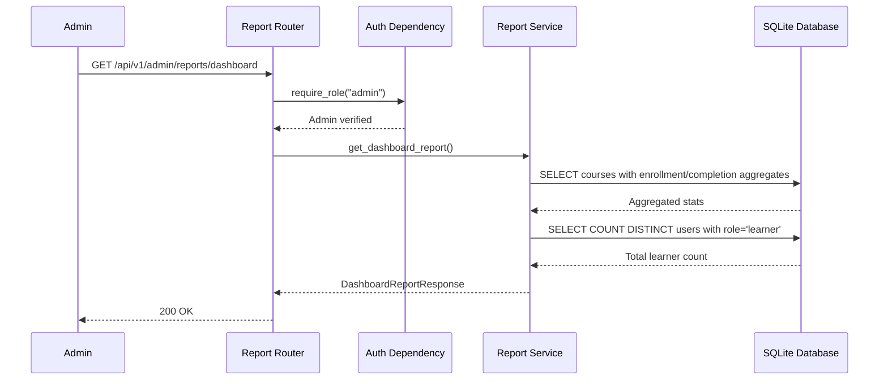
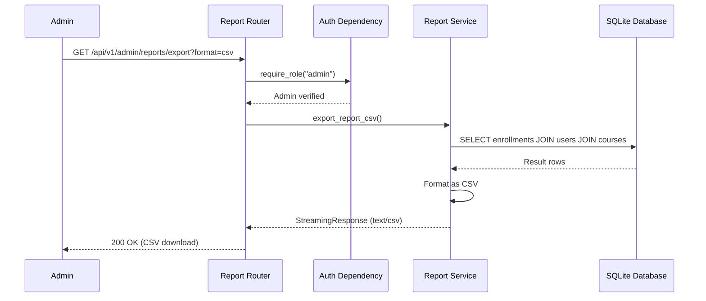

# Low-Level Design (LLD)

| Field                    | Value                                          |
|--------------------------|------------------------------------------------|
| **Title**                | Reporting Service — Low-Level Design           |
| **Component**            | Reporting Service                              |
| **Version**              | 1.0                                            |
| **Date**                 | 2026-04-22                                     |
| **Author**               | 2-plan-and-design-agent                        |
| **HLD Component Ref**    | COMP-005                                       |

---

## 1. Component Purpose & Scope

### 1.1 Purpose

The Reporting Service provides admin-facing dashboard data, including enrollment counts, completion rates per course, and per-learner progress views. It also supports data export in CSV format for offline analysis. This component satisfies BRD-FR-025 through BRD-FR-027.

### 1.2 Scope

- **Responsible for**: Aggregated enrollment/completion statistics per course, per-learner progress reports for a given course, CSV data export.
- **Not responsible for**: Enrollment management (COMP-004), course management (COMP-002), user authentication (COMP-001).
- **Interfaces with**: COMP-001 (Auth — admin-only access), COMP-007 (Database Layer — aggregate queries against enrollments, progress_records, courses).

---

## 2. Detailed Design

### 2.1 Module / Class Structure

```
src/
└── reporting/
    ├── __init__.py
    ├── router.py          # FastAPI routes for /api/v1/admin/reports/*
    ├── service.py         # Business logic: aggregate queries, export formatting
    └── models.py          # Pydantic schemas for report responses
```

### 2.2 Key Classes & Functions

| Class / Function                  | File          | Description                                                | Inputs                         | Outputs                      |
|-----------------------------------|---------------|------------------------------------------------------------|--------------------------------|------------------------------|
| `CourseDashboardStats`            | models.py     | Per-course enrollment and completion stats                 | course_id, title, enrollment_count, completion_rate | Validated model |
| `DashboardReportResponse`         | models.py     | Dashboard report with all course stats                     | list of CourseDashboardStats   | Validated model              |
| `LearnerProgressReport`          | models.py     | Per-learner progress within a course                       | user info, enrollment status, completion details | Validated model    |
| `CourseLearnersResponse`          | models.py     | All learners' progress for a specific course               | list of LearnerProgressReport  | Validated model              |
| `get_dashboard_report()`          | service.py    | Aggregates enrollment counts and completion rates per course | db                            | DashboardReportResponse      |
| `get_course_learner_progress()`   | service.py    | Gets per-learner progress for a specific course            | course_id, db                  | CourseLearnersResponse       |
| `export_report_csv()`             | service.py    | Generates CSV content from enrollment/completion data      | db, format_options             | CSV string or StreamingResponse |

### 2.3 Design Patterns Used

- **Service Layer**: Aggregate queries and formatting logic in `service.py`.
- **Read-Only Access**: This service only reads data; it never modifies enrollment or progress records.
- **Streaming Response**: CSV export uses FastAPI's `StreamingResponse` to handle potentially large datasets.

---

## 3. Data Models

### 3.1 Pydantic Models

```python
from pydantic import BaseModel
from typing import Optional
from datetime import datetime


class CourseDashboardStats(BaseModel):
    """Per-course statistics for the admin dashboard."""
    course_id: int
    course_title: str
    total_enrollments: int
    completed_enrollments: int
    in_progress_enrollments: int
    completion_rate: float  # 0.0 to 1.0


class DashboardReportResponse(BaseModel):
    """Admin dashboard report with all course stats."""
    courses: list[CourseDashboardStats]
    total_learners: int
    total_enrollments: int


class LearnerProgressReport(BaseModel):
    """Per-learner progress within a course."""
    user_id: int
    user_name: str
    user_email: str
    enrollment_status: str
    enrolled_at: datetime
    completed_lessons: int
    total_lessons: int
    completed_modules: int
    total_modules: int
    completion_percentage: float


class CourseLearnersResponse(BaseModel):
    """All learners' progress for a specific course."""
    course_id: int
    course_title: str
    learners: list[LearnerProgressReport]
```

### 3.2 Database Schema

No additional tables. This service uses read-only aggregate queries against existing tables: `enrollments`, `progress_records`, `courses`, `modules`, `lessons`, `users`.

---

## 4. API Specifications

### 4.1 Endpoints

| Method | Path                                        | Description                                      | Auth   | Request Body | Response Body             | Status Codes |
|--------|---------------------------------------------|--------------------------------------------------|--------|--------------|---------------------------|--------------|
| GET    | /api/v1/admin/reports/dashboard             | Dashboard stats: enrollments/completions per course | Admin | —            | DashboardReportResponse   | 200          |
| GET    | /api/v1/admin/reports/courses/{id}/learners | Per-learner progress for a specific course       | Admin  | —            | CourseLearnersResponse    | 200, 404     |
| GET    | /api/v1/admin/reports/export?format=csv     | Export enrollment/completion data as CSV          | Admin  | —            | CSV file (StreamingResponse) | 200       |

### 4.2 Request / Response Examples

```json
// GET /api/v1/admin/reports/dashboard
// 200 OK
{
    "courses": [
        {
            "course_id": 1,
            "course_title": "GitHub Foundations",
            "total_enrollments": 25,
            "completed_enrollments": 12,
            "in_progress_enrollments": 10,
            "completion_rate": 0.48
        },
        {
            "course_id": 2,
            "course_title": "GitHub Advanced Security",
            "total_enrollments": 15,
            "completed_enrollments": 5,
            "in_progress_enrollments": 8,
            "completion_rate": 0.33
        }
    ],
    "total_learners": 30,
    "total_enrollments": 40
}
```

```json
// GET /api/v1/admin/reports/courses/1/learners
// 200 OK
{
    "course_id": 1,
    "course_title": "GitHub Foundations",
    "learners": [
        {
            "user_id": 5,
            "user_name": "Jane Learner",
            "user_email": "jane@example.com",
            "enrollment_status": "in_progress",
            "enrolled_at": "2026-04-20T10:00:00Z",
            "completed_lessons": 6,
            "total_lessons": 9,
            "completed_modules": 2,
            "total_modules": 3,
            "completion_percentage": 66.7
        }
    ]
}
```

---

## 5. Sequence Diagrams

### 5.1 Dashboard Report



### 5.2 CSV Export



---

## 6. Error Handling Strategy

### 6.1 Exception Hierarchy

| Exception / Condition         | HTTP Status | Description                             | Retry? |
|-------------------------------|-------------|-----------------------------------------|--------|
| Course not found              | 404         | No course with the given ID             | No     |
| Unauthorized                  | 401         | Missing or invalid auth token           | No     |
| Forbidden                     | 403         | Non-admin accessing admin reports       | No     |

### 6.2 Error Response Format

```json
{
    "detail": "Course not found"
}
```

### 6.3 Logging

- **INFO**: Dashboard report accessed (admin_id). Course learner report accessed (admin_id, course_id). CSV export generated (admin_id).
- **ERROR**: Database query failures on aggregate operations.

---

## 7. Configuration & Environment Variables

| Variable                  | Description                                    | Required | Default              |
|---------------------------|------------------------------------------------|----------|----------------------|
| DATABASE_URL              | Path to SQLite database file                   | No       | sqlite:///learning.db |

No additional configuration beyond the shared application settings.

---

## 8. Dependencies

### 8.1 Internal Dependencies

| Component              | Purpose                                              | Interface                |
|------------------------|------------------------------------------------------|--------------------------|
| COMP-001 (Auth)        | Admin-only access to reporting endpoints             | FastAPI Depends()        |
| COMP-007 (Database)    | Read-only aggregate queries on all content/progress tables | SQL queries via aiosqlite |

### 8.2 External Dependencies

| Package / Service       | Version           | Purpose                                           |
|-------------------------|-------------------|---------------------------------------------------|
| fastapi                 | 0.115+            | Web framework, routing, dependency injection       |
| pydantic                | 2.x               | Response validation                                |
| aiosqlite               | 0.20+             | Async SQLite database access                       |

---

## 9. Traceability

| LLD Element                                    | HLD Component  | BRD Requirement(s)     |
|------------------------------------------------|----------------|------------------------|
| GET /api/v1/admin/reports/dashboard            | COMP-005       | BRD-FR-025             |
| GET /api/v1/admin/reports/courses/{id}/learners | COMP-005      | BRD-FR-026             |
| GET /api/v1/admin/reports/export?format=csv    | COMP-005       | BRD-FR-027             |
