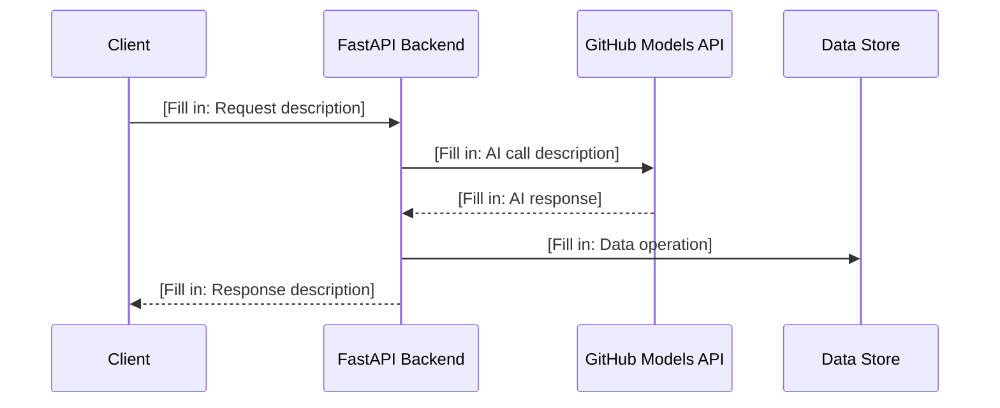

# High-Level Design (HLD)

| Field              | Value                                      |
|--------------------|--------------------------------------------|
| **Title**          | [Fill in: Project Title — High-Level Design] |
| **Version**        | [Fill in: e.g., 1.0]                       |
| **Date**           | [Fill in: YYYY-MM-DD]                      |
| **Author**         | [Fill in: Author Name]                     |
| **BRD Reference**  | [Fill in: BRD document name and version]   |

---

## 1. Design Overview & Goals

### 1.1 Purpose

[Fill in: Summarize what this design covers. This HLD describes the architecture of an AI-powered learning platform built with Python, FastAPI, and the GitHub Models API, targeting MVP delivery for three training topics: GitHub Actions, GitHub Copilot, and GitHub Advanced Security.]

### 1.2 Design Goals

- [Fill in: e.g., Keep the architecture simple and suitable for a single-developer MVP]
- [Fill in: e.g., Ensure clean separation between API, AI integration, and content layers]
- [Fill in: e.g., Make it easy to add new training topics without architectural changes]

### 1.3 Design Constraints

- [Fill in: e.g., Must run locally for MVP — no cloud deployment required]
- [Fill in: e.g., GitHub Models API is the sole AI provider]

---

## 2. Architecture Diagram

```
[Fill in: ASCII or Mermaid diagram showing the high-level system architecture]

Example structure:

┌─────────────┐     ┌──────────────┐     ┌─────────────────────┐
│   Browser /  │────▶│   FastAPI     │────▶│   GitHub Models API │
│   Client     │◀────│   Backend     │◀────│                     │
└─────────────┘     └──────┬───────┘     └─────────────────────┘
                           │
                    ┌──────▼───────┐
                    │  Local Data   │
                    │  Store        │
                    └──────────────┘
```

---

## 3. System Components

| Component ID | Name                       | Description                                           | Technology          | BRD Requirements    |
|--------------|----------------------------|-------------------------------------------------------|---------------------|---------------------|
| COMP-001     | [Fill in: Component name]  | [Fill in: What this component does]                   | [Fill in: Tech]     | BRD-FR-001, ...     |
| COMP-002     | [Fill in: Component name]  | [Fill in: What this component does]                   | [Fill in: Tech]     | BRD-FR-002, ...     |
| COMP-003     | [Fill in: Component name]  | [Fill in: What this component does]                   | [Fill in: Tech]     | BRD-FR-003, ...     |
| COMP-004     | [Fill in: Component name]  | [Fill in: What this component does]                   | [Fill in: Tech]     | BRD-AI-001, ...     |
| COMP-005     | [Fill in: Component name]  | [Fill in: What this component does]                   | [Fill in: Tech]     | BRD-NFR-001, ...    |

---

## 4. Component Interactions

### 4.1 Communication Patterns

[Fill in: Describe how components communicate — e.g., REST API calls between client and backend, direct function calls between internal modules, HTTP calls to GitHub Models API.]

### 4.2 Interaction Diagram



---

## 5. Data Flow Overview

### 5.1 Primary Data Flows

[Fill in: Describe the key data flows through the system — how a learning request moves from user input to AI-generated content to displayed output.]

### 5.2 Data Flow Diagram

```
[Fill in: ASCII or Mermaid diagram showing data flow]

User Request ──▶ Input Validation ──▶ Prompt Construction ──▶ GitHub Models API
                                                                     │
User Response ◀── Response Formatting ◀── Content Processing ◀──────┘
```

---

## 6. GitHub Models API Integration Design

### 6.1 Integration Approach

[Fill in: Describe the overall strategy for integrating with GitHub Models API — e.g., a dedicated service module that handles all AI calls, prompt templates per topic, response parsing.]

### 6.2 API Usage Patterns

| Pattern              | Description                                          | Endpoint / Model        |
|----------------------|------------------------------------------------------|-------------------------|
| [Fill in: Pattern]   | [Fill in: How the API is used for this pattern]      | [Fill in: Model name]   |
| [Fill in: Pattern]   | [Fill in: How the API is used for this pattern]      | [Fill in: Model name]   |

### 6.3 Prompt Management

[Fill in: How prompts are structured, stored, and versioned. Describe any template system used for the three training topics (GitHub Actions, Copilot, Advanced Security).]

### 6.4 Error Handling & Resilience

[Fill in: How the system handles API errors, rate limits, timeouts, and unexpected responses.]

---

## 7. Technology Stack

| Layer            | Technology                | Version / Notes               | Rationale                                      |
|------------------|---------------------------|-------------------------------|-------------------------------------------------|
| Language         | Python                    | [Fill in: e.g., 3.11+]       | [Fill in: Why Python]                           |
| Web Framework    | FastAPI                   | [Fill in: Version]            | [Fill in: Why FastAPI]                          |
| AI Integration   | GitHub Models API         | [Fill in: Version/Model]      | [Fill in: Why GitHub Models]                    |
| Data Storage     | [Fill in: e.g., SQLite]   | [Fill in: Version]            | [Fill in: Why this storage for MVP]             |
| Frontend         | [Fill in: e.g., Jinja2]   | [Fill in: Version]            | [Fill in: Why this approach]                    |
| Testing          | [Fill in: e.g., pytest]   | [Fill in: Version]            | [Fill in: Why this framework]                   |
| Package Manager  | [Fill in: e.g., pip/uv]   | [Fill in: Version]            | [Fill in: Why this tool]                        |

---

## 8. Deployment Architecture

### 8.1 MVP / Local Development

[Fill in: Describe the local development setup — how a developer runs the platform locally. Include environment setup, required env vars (e.g., GitHub token), and how to start the server.]

```
[Fill in: Diagram or description of local deployment]

Developer Machine
├── Python virtual environment
├── FastAPI server (uvicorn)
├── Local data store
└── Outbound HTTPS ──▶ GitHub Models API
```

### 8.2 Future Deployment Considerations

[Fill in: Brief notes on how the architecture could evolve for production — e.g., containerization, cloud hosting. Keep this lightweight for MVP.]

---

## 9. Security Considerations

| Area                   | Approach                                                     |
|------------------------|--------------------------------------------------------------|
| API Key Management     | [Fill in: How GitHub token / API keys are stored and used]   |
| Input Validation       | [Fill in: How user input is validated before processing]     |
| Data Privacy           | [Fill in: What data is stored and how it is protected]       |
| Dependency Security    | [Fill in: How dependencies are vetted and kept up to date]   |
| [Fill in: Area]        | [Fill in: Approach]                                          |

---

## 10. Design Decisions & Trade-offs

| Decision ID | Decision                          | Options Considered                     | Chosen Option          | Rationale                                      |
|-------------|-----------------------------------|----------------------------------------|------------------------|-------------------------------------------------|
| DD-001      | [Fill in: Decision description]   | [Fill in: Option A, Option B, ...]     | [Fill in: Chosen]      | [Fill in: Why this option was selected]         |
| DD-002      | [Fill in: Decision description]   | [Fill in: Option A, Option B, ...]     | [Fill in: Chosen]      | [Fill in: Why this option was selected]         |
| DD-003      | [Fill in: Decision description]   | [Fill in: Option A, Option B, ...]     | [Fill in: Chosen]      | [Fill in: Why this option was selected]         |

---

## 11. Traceability Matrix

| HLD Component | BRD Functional Reqs       | BRD Non-Functional Reqs   | BRD AI Reqs         |
|---------------|---------------------------|---------------------------|----------------------|
| COMP-001      | [Fill in: BRD-FR-xxx]     | [Fill in: BRD-NFR-xxx]    | —                    |
| COMP-002      | [Fill in: BRD-FR-xxx]     | [Fill in: BRD-NFR-xxx]    | —                    |
| COMP-003      | [Fill in: BRD-FR-xxx]     | —                         | [Fill in: BRD-AI-xxx]|
| COMP-004      | [Fill in: BRD-FR-xxx]     | [Fill in: BRD-NFR-xxx]    | [Fill in: BRD-AI-xxx]|
| COMP-005      | —                         | [Fill in: BRD-NFR-xxx]    | —                    |
