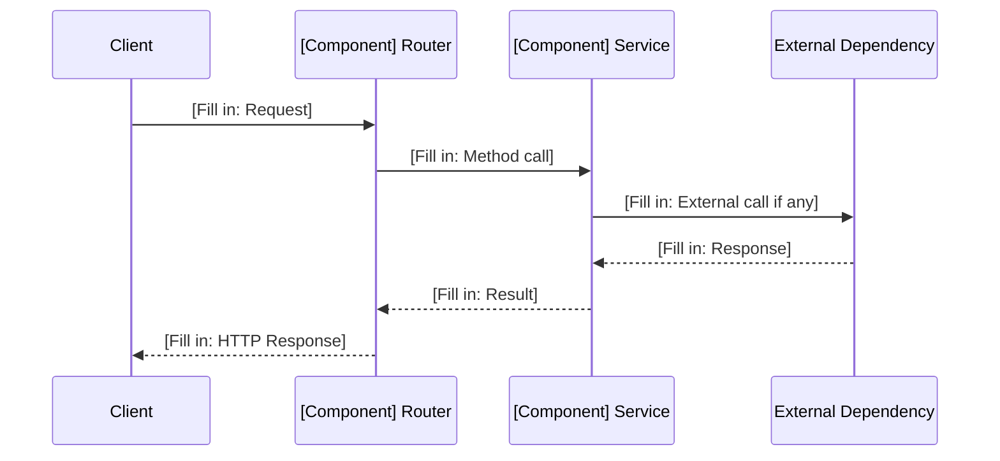
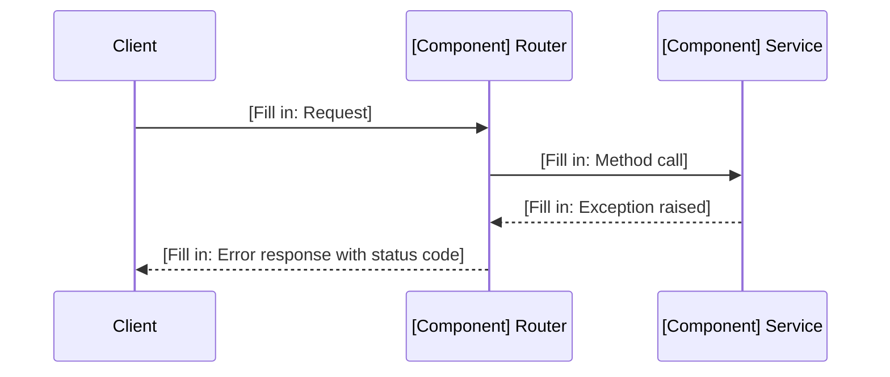

# Low-Level Design (LLD)

| Field                    | Value                                          |
|--------------------------|------------------------------------------------|
| **Title**                | [Fill in: Component Name — Low-Level Design]   |
| **Component**            | [Fill in: Component name from HLD]             |
| **Version**              | [Fill in: e.g., 1.0]                           |
| **Date**                 | [Fill in: YYYY-MM-DD]                          |
| **Author**               | [Fill in: Author Name]                         |
| **HLD Component Ref**    | [Fill in: e.g., COMP-001]                      |

---

## 1. Component Purpose & Scope

### 1.1 Purpose

[Fill in: What this component does and why it exists. Reference the HLD component description and the BRD requirements it satisfies.]

### 1.2 Scope

- **Responsible for**: [Fill in: What this component owns]
- **Not responsible for**: [Fill in: What is handled by other components]
- **Interfaces with**: [Fill in: Other components this one communicates with]

---

## 2. Detailed Design

### 2.1 Module / Class Structure

```
[Fill in: Directory and file layout for this component]

src/
└── [component_name]/
    ├── __init__.py
    ├── router.py          # [Fill in: FastAPI route definitions]
    ├── service.py         # [Fill in: Business logic]
    ├── models.py          # [Fill in: Pydantic models / schemas]
    ├── dependencies.py    # [Fill in: Dependency injection]
    └── exceptions.py      # [Fill in: Custom exceptions]
```

### 2.2 Key Classes & Functions

| Class / Function         | File           | Description                                    | Inputs                  | Outputs                |
|--------------------------|----------------|------------------------------------------------|-------------------------|------------------------|
| [Fill in: Name]          | [Fill in]      | [Fill in: What it does]                        | [Fill in: Parameters]   | [Fill in: Return type] |
| [Fill in: Name]          | [Fill in]      | [Fill in: What it does]                        | [Fill in: Parameters]   | [Fill in: Return type] |
| [Fill in: Name]          | [Fill in]      | [Fill in: What it does]                        | [Fill in: Parameters]   | [Fill in: Return type] |
| [Fill in: Name]          | [Fill in]      | [Fill in: What it does]                        | [Fill in: Parameters]   | [Fill in: Return type] |

### 2.3 Design Patterns Used

- [Fill in: e.g., Repository pattern for data access]
- [Fill in: e.g., Dependency injection via FastAPI Depends()]
- [Fill in: Additional patterns]

---

## 3. Data Models

### 3.1 Pydantic Models

```python
# [Fill in: Model definitions for this component]

from pydantic import BaseModel
from typing import Optional
from datetime import datetime


class ExampleRequest(BaseModel):
    """[Fill in: Description]"""
    # [Fill in: field definitions]
    pass


class ExampleResponse(BaseModel):
    """[Fill in: Description]"""
    # [Fill in: field definitions]
    pass
```

### 3.2 Database Schema (if applicable)

```sql
-- [Fill in: Table definitions if this component owns database tables]

-- CREATE TABLE [table_name] (
--     id INTEGER PRIMARY KEY,
--     [Fill in: columns]
--     created_at TIMESTAMP DEFAULT CURRENT_TIMESTAMP
-- );
```

---

## 4. API Specifications

### 4.1 Endpoints

| Method | Path                        | Description                        | Request Body             | Response Body            | Status Codes       |
|--------|-----------------------------|------------------------------------|--------------------------|--------------------------|---------------------|
| GET    | [Fill in: /api/v1/...]      | [Fill in: What it does]            | —                        | [Fill in: Response type] | 200, 404            |
| POST   | [Fill in: /api/v1/...]      | [Fill in: What it does]            | [Fill in: Request type]  | [Fill in: Response type] | 201, 400, 422       |
| PUT    | [Fill in: /api/v1/...]      | [Fill in: What it does]            | [Fill in: Request type]  | [Fill in: Response type] | 200, 404, 422       |
| DELETE | [Fill in: /api/v1/...]      | [Fill in: What it does]            | —                        | —                        | 204, 404            |

### 4.2 Request / Response Examples

```json
// [Fill in: Example request]
// POST /api/v1/[endpoint]
{
    "[Fill in: field]": "[Fill in: value]"
}
```

```json
// [Fill in: Example response]
// 200 OK
{
    "[Fill in: field]": "[Fill in: value]"
}
```

---

## 5. Sequence Diagrams

### 5.1 Primary Flow



### 5.2 Error Flow



---

## 6. Error Handling Strategy

### 6.1 Exception Hierarchy

| Exception Class              | HTTP Status | Description                                | Retry? |
|------------------------------|-------------|--------------------------------------------|--------|
| [Fill in: Exception name]    | 400         | [Fill in: When this is raised]             | No     |
| [Fill in: Exception name]    | 404         | [Fill in: When this is raised]             | No     |
| [Fill in: Exception name]    | 429         | [Fill in: When this is raised]             | Yes    |
| [Fill in: Exception name]    | 500         | [Fill in: When this is raised]             | Yes    |

### 6.2 Error Response Format

```json
{
    "error": {
        "code": "[Fill in: Error code]",
        "message": "[Fill in: User-facing message]",
        "details": "[Fill in: Optional additional context]"
    }
}
```

### 6.3 Logging

[Fill in: What is logged at each level — INFO for normal operations, WARNING for recoverable issues, ERROR for failures. Include what context is captured (request ID, user, etc.).]

---

## 7. Configuration & Environment Variables

| Variable                  | Description                                | Required | Default              |
|---------------------------|--------------------------------------------|----------|----------------------|
| [Fill in: VAR_NAME]       | [Fill in: What this configures]            | Yes      | —                    |
| [Fill in: VAR_NAME]       | [Fill in: What this configures]            | No       | [Fill in: Default]   |
| [Fill in: VAR_NAME]       | [Fill in: What this configures]            | No       | [Fill in: Default]   |

---

## 8. Dependencies

### 8.1 Internal Dependencies

| Component          | Purpose                                       | Interface               |
|--------------------|-----------------------------------------------|-------------------------|
| [Fill in: COMP-xxx]| [Fill in: Why this component depends on it]    | [Fill in: How it calls] |
| [Fill in: COMP-xxx]| [Fill in: Why this component depends on it]    | [Fill in: How it calls] |

### 8.2 External Dependencies

| Package / Service       | Version           | Purpose                                  |
|-------------------------|-------------------|------------------------------------------|
| [Fill in: Package]      | [Fill in: Version]| [Fill in: What it is used for]           |
| [Fill in: Package]      | [Fill in: Version]| [Fill in: What it is used for]           |
| [Fill in: Package]      | [Fill in: Version]| [Fill in: What it is used for]           |

---

## 9. Traceability

| LLD Element                | HLD Component  | BRD Requirement(s)              |
|----------------------------|----------------|---------------------------------|
| [Fill in: Class/endpoint]  | [Fill in: ID]  | [Fill in: BRD-FR-xxx, ...]      |
| [Fill in: Class/endpoint]  | [Fill in: ID]  | [Fill in: BRD-FR-xxx, ...]      |
| [Fill in: Class/endpoint]  | [Fill in: ID]  | [Fill in: BRD-AI-xxx, ...]      |
